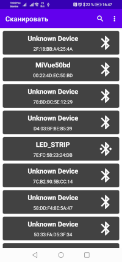
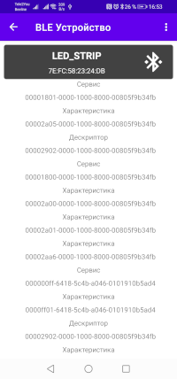

# Простейший сканнер BLE




## Зачем?

Честно говоря, библиотека
[NordicSemiconductor Android BLE Library](https://github.com/NordicSemiconductor/Android-BLE-Library/)
полностью устраивает всех, кто хочет работать со стеком BLE на платформе Android.
C 'нативным' стеком BLE, возможно просто мало кто хочет связываться, учитвая просто огромный список сложностей (Issues),
которые возникают при создании собственного стека работы с BLE Android. К сожалению, официальном руководстве
[Android BLE](https://developer.android.com/guide/topics/connectivity/bluetooth/ble-overview) об этом говорится очень немного.

К примеру,
[проблема работы фильтров при сканировании BLE устройств](https://stackoverflow.com/questions/34065210/android-ble-device-scan-with-filter-is-not-working/34092300), так до сих пор и не решена на многих устройствах.

Конечно, есть прекрасная облегчённая библиотека Мартина Велле [BLESSED](https://github.com/weliem/blessed-android) написанная на Java
и аналогичная версия на Kotlin [Coroutines BLESSED](https://github.com/weliem/blessed-android-coroutines)

Однако, иногда бывает нужно сделать что-то совершенно своё, особенное. Для этого надо хорошее понимание основных проблемм работы со стеком BLE.

То есть, создание собственной библиотеки BLE имеет, скорее учебное значение, нежели практическое применение.

## Основные проблемы

Пожалуй, основная проблема BLE — это нестабильное подключение к устройству.

1. [`BluetoothGatt.discoverServices`](https://developer.android.com/reference/android/bluetooth/BluetoothGatt#discoverServices())
    Довольно часто возвращает `false`. Некоторые попытки сниффинга обмена данными по Bluetooth говорят о нарушениях протокола Bluetooth 4+ в ОС Android.

2. [`BluetoothDevice.connectGatt`](https://developer.android.com/reference/android/bluetooth/BluetoothDevice#connectGatt(android.content.Context,%20boolean,%20android.bluetooth.BluetoothGattCallback))
    при неправильном использовании параметра `autoConnect` так же может вернуть ошибку со статусом 6 или 131 (плохо объяснённые в официальном руководстве). Причём правильное значение параметра, `autoConnect`, зависит от версии Android и модели мобильного телефона. Недокументированная мистика!
    Штатное решение, придуманное программистами NordicSemiconductor: в качестве значения `autoConnect` использовать `bluetoothDevice!!.type == BluetoothDevice.DEVICE_TYPE_UNKNOWN`. Подробнее, см. [Martin van Wellie // Making Android BLE work — part 2](https://medium.com/@martijn.van.welie/making-android-ble-work-part-2-47a3cdaade07?source=user_profile---------2-------------------------------)

3. [BluetoothGattCallback.onConnectionStateChange](https://stackoverflow.com/questions/38666462/android-catching-ble-connection-fails-disconnects)
    не всегда срабатывает при отключении устройства, если скажем, оно не сопряжено с телефоном (некоторые устройства без сопряжения автоматически
    разрывают связь через 30 секунд)

4. Количество [разрешений](https://developer.android.com/reference/android/Manifest.permission),
    необходимых для
    [включения/выключения, сканирования, считывания рекламы](https://developer.android.com/guide/topics/connectivity/bluetooth/permissions)
    [`Bluetooth`](https://developer.android.com/guide/topics/connectivity/bluetooth),
    [BLE](https://developer.android.com/guide/topics/connectivity/bluetooth/ble-overview),
    постоянно колеблется от одной версии к другой. И с каждой версией список только растёт:

```xml
<manifest>
    <!-- Запросить устаревшие разрешения Bluetooth на старых устройствах -->
    <uses-permission android:name="android.permission.BLUETOOTH"
        android:maxSdkVersion="30" />
    <uses-permission android:name="android.permission.BLUETOOTH_ADMIN"
        android:maxSdkVersion="30" />

    <!-- Требуется только в том случае, если ваше приложение ищет устройства Bluetooth.
         Если ваше приложение не использует результаты сканирования Bluetooth для получения
         информации о физическом местоположении, вы можете твердо утверждать,
         что ваше приложение не определяет физическое местоположение. -->
    <uses-permission android:name="android.permission.BLUETOOTH_SCAN" />

    <!-- Требуется только в том случае, если ваше приложение позволяет обнаруживать устройство для
         устройств Bluetooth. -->
    <uses-permission android:name="android.permission.BLUETOOTH_ADVERTISE" />

    <!-- Требуется только в том случае, если ваше приложение обменивается данными с уже сопряженными
         устройствами Bluetooth.. -->
    <uses-permission android:name="android.permission.BLUETOOTH_CONNECT" />

    <!-- Требуется только в том случае, если ваше приложение использует результаты сканирования
         Bluetooth для определения физического местоположения. -->
    <uses-permission android:name="android.permission.ACCESS_FINE_LOCATION" />
    ...
</manifest>
```

    На первых порах сильное удивление вызвает необходимость давать разрешение на локацию. Причём, эти запросы уровня `dangerous`, т.е., требуют программного запроса на доступ.

    Запросы уровня `dangerous`
    [android.permission.ACCESS_FINE_LOCATION](https://developer.android.com/reference/android/Manifest.permission#ACCESS_FINE_LOCATION),
    [android.permission.ACCESS_COARSE_LOCATION](https://developer.android.com/reference/android/Manifest.permission#ACCESS_COARSE_LOCATION),
    [android.permission.ACCESS_BACKGROUND_LOCATION](https://developer.android.com/reference/android/Manifest.permission#ACCESS_COARSE_LOCATION)
    нужно запрашивать напрямую, скажем, из `Активности`. Для этого созданы две функции, чтобы реализовать запрос массива разрешений:

```kotlin
    /**
     * Проверка группы разрешений
     */
    private fun requestPermissions(permissions: MutableList<String>) {
        var launchPermissions: MutableList<String> = arrayListOf()
        permissions.forEach { permission ->
            if (ContextCompat.checkSelfPermission(
                    this,
                    permission
                ) == PackageManager.PERMISSION_GRANTED
            ) {
                Log.d(TAG, "Разрешение на $permission уже есть")
            } else {
                launchPermissions.add(permission)
            }
        }

        permissionsLauncher(launchPermissions)
    }

    /**
     * Запрос группы разрешений
     */
    private fun permissionsLauncher(permissions: List<String>) {
        if (permissions.isNotEmpty()) {
            val launcher =
                registerForActivityResult(ActivityResultContracts.RequestMultiplePermissions()) { results ->
                    results?.entries?.forEach { result ->
                        val name = result.key
                        val isGranted = result.value
                        if (isGranted) {
                            Toast.makeText(this, "Разрешение на $name получено", Toast.LENGTH_SHORT)
                                .show()
                        } else {
                            Toast.makeText(this, "Разрешение на $name не дано", Toast.LENGTH_SHORT)
                                .show()
                        }
                    }
                }
            launcher.launch(permissions.toTypedArray())
        }
    }
```

    И запрос будет выглядеть так:

```kotlin
        requestPermissions(
            mutableListOf(
                Manifest.permission.ACCESS_FINE_LOCATION,
                Manifest.permission.ACCESS_COARSE_LOCATION,
                Manifest.permission.ACCESS_BACKGROUND_LOCATION
            )
        )
```

5. Также, режим фильтрации сканирования по адресу на многих устройствах до сих пор не работает. По какой-то
    причине этот дефект не устранён за последние... да лет пять тому, как, чтобы не соврать.
    Поэтому, нужно делать свой фильтр.

## Простейший сканнер

Учитывая, что фильтры на многих устройствах не работают, лучше сразу заложить возможность фильтрования имён и адресов.

### Сервисы

Стоит ли делать сканнер сервисом, если он и так уже сервис или можно вызвать его в Активности/Фрагменте?
В данном случае, приянто решение скомпоновать сканирование/подключение в одной упаковке. Поскольку в документации довольно строго сказано, что работа с Bluetooth должна выполняться в основном UI-потоке приложения, вызов будет удобнее сделать именно в сервисе, поскольку, для стабильного подключения к устройству иногда придётся делать кратковременное сканирование устройств с фильтром по адресу подключаемогоу устройства, а значит сканирование должно быть доступно из разных объектов программы, в т.ч. из сервиса подключения к BLE-устройству.

Таким образом, будет один сервис:

1. [`BtLeService`](./app/src/main/java/com/grandfatherpikhto/blescan/service/BtLeService.kt) — сервис подключения к BLE устройству

После того, как созданы классы сервисов, надо прописать их в [`AndroidManifest.xml`](./app/src/main/AndroidManifest.xml):

```xml
<?xml version="1.0" encoding="utf-8"?>
<manifest xmlns:android="http://schemas.android.com/apk/res/android"
        package="com.grandfatherpikhto.blescan">
    <application>
        <service android:name=".service.BtLeService" android:enabled="true" />
    </application>
</manifest>
```

в данной ситуации не будем использовать
[`LifecycleService`](https://developer.android.com/reference/androidx/lifecycle/LifecycleService))
хотя его возможности позволят отлично синхронизировать жизненные циклы `MainActivity` и сервиса.
Воспользуемся старым добрым [`Service`](https://developer.android.com/guide/components/services)
с привязкой при помощи [`IBinder`](https://developer.android.com/reference/android/os/IBinder) и
[`ServiceConnection`](https://developer.android.com/reference/android/content/ServiceConnection).

### Передачу данных между сервисами и объектами можно организовать при помощи трёх способов

1. Можно создать широковещательные приемники/передатчики и рассылать/получать уведомления.
   при помощи [`Broadcastreceiver`](https://developer.android.com/reference/android/content/BroadcastReceiver),
   [`IntentFilter`](https://developer.android.com/reference/android/content/IntentFilter),
   [`sendBroadcast`](https://developer.android.com/reference/android/content/Context#sendBroadcast(android.content.Intent)),
   как это достаточно подробно описано в примерах [`broadcasts`](https://developer.android.com/guide/components/broadcasts).

```java
Intent intent = new Intent("com.grandfatherpikhto.blescan.NEW_DEVICE_DETECTED");
// Intent intent = new Intent();
// intent.setAction("com.grandfatherpikhto.blescan.NEW_DEVICE_DETECTED");

intent.putExtra("device", device.name);
intent.putExtra("address", device.address);
intent.putExtra("bond", device.getBondState());
sendBroadcast(intent);
```

```kotlin
Intent().also { intent ->
    intent.setAction("com.grandfatherpikhto.blescan.NEW_DEVICE_DETECTED")
    intent.putExtra("device", device.name);
    intent.putExtra("address", device.address);
    intent.putExtra("bond", device.bondState);
    sendBroadcast(intent)
}
```

И не забыть добавить описание сообщений в [`AndroidManifest.xml`](./app/src/main/AndroidManifest.xml)

```xml
<receiver android:name=".MyBroadcastReceiver"  android:exported="true">
   <intent-filter>
      <action android:name="com.grandfatherpikhto.blescan.NEW_DEVICE_DETECTED"/>
   </intent-filter>
</receiver>
```

Недостаток широковещательного приёмника/передатчик состоит в том, что нельзя сразу передавать
объекты и скорость передачи относительно невысока, а нагрузка на Android при больших потоках
данных, возрастает.

2. Если бы нагрузка была небольшой, можно было бы использовать
  [`Preferences`](https://developer.android.com/reference/androidx/preference/package-summary).

3. Для кратковременного совместного использования сложных непостоянных определенных пользователем объектов рекомендуются следующие подходы:
  a. Класс [`android.app.Application`](https://developer.android.com/reference/android/app/Application).
  Он имеет несколько методов жизненного цикла и будет автоматически создан Android, если зарегистрировать его в
  [AndroidManifest.xml](./app/src/main/AndroidManifest.xml):

```xml
  <application
      android:name=".BLEScanApp">

  </application>
```

  Доступ к синглетону приложения можно получить через
  [`getApplication()`](https://developer.android.com/reference/android/app/Activity#getApplication())
  из любого действия или из [службы](https://developer.android.com/reference/android/app/Service#getApplication()).

4. Публичное статическое поле/метод
  Альтернативный способ сделать данные доступными для всех действий/служб — использовать
  общедоступные статические поля и/или методы. Вы можете получить доступ к этим статическим
  полям из любого другого класса в вашем приложении. Чтобы поделиться объектом, действие,
  которое создает ваш объект, устанавливает статическое поле, указывающее на этот объект,
  а любое другое действие, которое хочет использовать этот объект, просто обращается к
  этому статическому полю.

5. Можно использовать [`HashMap`](https://developer.android.com/reference/java/util/HashMap)
  слабюых ссылок на объекты
  [`WeakReferences`](https://developer.android.com/reference/java/lang/ref/WeakReference)
  для объектов с длинными ключами.

   Когда действие хочет передать объект другому действию, оно просто помещает объект на карту
   и отправляет ключ (который является уникальным Long на основе счетчика или отметки времени)
   действию получателя через дополнительные функции намерения.
   Действие получателя извлекает объект с помощью этого ключа.

6. Синглтон-класс

   У использования статического синглтона есть преимущества. Например, можно ссылаться на объекты,
   не используя [`getApplication()`](https://developer.android.com/reference/android/app/Activity#getApplication())
   к классу, зависящему от приложения,
   или можно сделать интерфейс на все подклассы Application, чтобы различные модули могли
   ссылаться на этот интерфейс вместо этого.

   Жизненный цикл статики не находится под вашим контролем; поэтому, чтобы соответствовать
   модели жизненного цикла, класс приложения должен инициировать и удалять эти статические
   объекты в методах `onCreate()` и `onTerminate()` класса приложения.

7. Постоянные объекты. Даже если кажется, что приложение продолжает работать, система может
   остановить его процесс и перезапустить его позже. Если у нас есть данные, которые необходимо
   сохранять от одного вызова действия к другому, необходимо представить эти данные как состояние,
   которое сохраняется действием, когда ему сообщается, что оно может исчезнуть.
   Для совместного использования сложных постоянных определенных пользователем объектов есть
   следующие подходы:

    • [`Application Preferences`](https://developer.android.com/jetpack/androidx/releases/preference)
    • [`Files`](https://developer.android.com/reference/java/io/File)
    • [`contentProviders`](https://developer.android.com/reference/android/content/ContentProvider)
    • [`SQLite`](https://developer.android.com/training/data-storage/sqlite) DB

   Если общие данные необходимо сохранить в точках, где процесс приложения может быть остановлен,
   данные можно помкестить в постоянное хранилище, такое как настройки приложения,
   база данных [`SQLite`](https://developer.android.com/training/data-storage/sqlite),
   файлы или [`ContentProviders`](https://developer.android.com/reference/android/content/ContentProvider).
   Подробнее в разделе [хранилище данных](https://developer.android.com/training/data-storage/room).

   В данном случае выбран синглтон (объект). Может быть, то не очень оптимально в смысле экономии
   памяти, но удобно в использовании.
   Создано два класса: [`BtLeServiceConnector`](./app/src/main/java/com/grandfatherpikhto/blescan/service/BtLeServiceConnector.kt)
   и [`BtLeServiceConnector`](./app/src/main/java/com/grandfatherpikhto/blescan/service/BtLeServiceConnector.kt)

### Активация сервиса

Пока, привязка сервиса находится в
[`MainActivity`](./app/src/main/java/com/grandfatherpikhto/blescan/MainActivity.kt). Можно использовать [`BleScanApp`](./app/src/main/java/com/grandfatherpikhto/blescan/BleScanApp.kt)
и наследовать сервисы от [`LifecycleService`](https://developer.android.com/reference/androidx/lifecycle/LifecycleService) при повороте экрана сервисы не будут уничтожаться, скажем, при повороте экрана или уходе приложения в фоновый режим.

Вызов реализован через [Intent](https://developer.android.com/reference/android/content/Intent) по событию жизненного цикла [MainActivity](./app/src/main/java/com/grandfatherpikhto/blescan/MainActivity.kt) `onStart()`:

```kotlin
    override fun onResume() {
        super.onResume()
        Intent(this, BtLeService::class.java).also { intent ->
            bindService(intent, BtLeServiceConnector, Context.BIND_AUTO_CREATE)
        }
    }
```

и отвязывание сервиса происходит по событию жизненного цикла `onStop()`

```kotlin
    override fun onPause() {
        super.onPause()
        unbindService(BtLeServiceConnector)
    }
```

Понятно, что когда счётчик привязок обнуляется, сервис уничтожается. Если добавить такой же вызов, скажем в [BleScanApp](./app/src/main/java/com/grandfatherpikhto/blescan/BLEScanApp.kt),
жизненный цикл сервиса будет равен жизненному циклу приложения. Правда, в таком решении есть свои сложности: обычный сервис не может действовать в фоновом режиме.

### Сервис [BtLeService](./app/src/main/java/com/grandfatherpikhto/blescan/service/BtLeService.kt)

#### Сканирование

Соответственно, общение с сервисом осуществляется через объект
[BtLeServiceConnector](./app/src/main/java/com/grandfatherpikhto/blescan/service/BtLeService.kt)
наследованный от [ServiceConnection](https://developer.android.com/reference/android/content/ServiceConnection). Фактически, это синглетон, жизненный цикл которого равен жизненному циклу приложения.

Для связи с ним используются не объекты
[LiveData](https://developer.android.com/topic/libraries/architecture/livedata) и
[MutableLiveData](https://developer.android.com/reference/androidx/lifecycle/MutableLiveData),
а Сопрограммы Kotlin (Kotlin Koroutines)
[MutableStateFlow](https://kotlin.github.io/kotlinx.coroutines/kotlinx-coroutines-core/kotlinx.coroutines.flow/-mutable-state-flow/index.html),
[StateFlow](https://kotlin.github.io/kotlinx.coroutines/kotlinx-coroutines-core/kotlinx.coroutines.flow/-state-flow/index.html) и
[MutableSharedFlow](https://kotlin.github.io/kotlinx.coroutines/kotlinx-coroutines-core/kotlinx.coroutines.flow/-mutable-shared-flow/),
[SharedFlow](https://kotlin.github.io/kotlinx.coroutines/kotlinx-coroutines-core/kotlinx.coroutines.flow/-shared-flow/index.html)

В принципе, этого можно было и не делать, но жизненный цикл
[потоков сопрограмм](https://developer.android.com/kotlin/flow/stateflow-and-sharedflow)
по ряду причин лучше приспособлен ко взаимодействию с сервисами и другими объектами, не содержащими
в контексте `View Lifecycle`

В сервисе [BtLeService](./app/src/main/java/com/grandfatherpikhto/blescan/service/BtLeService.kt) реализован интерфейс `привязывания`:

```kotlin
    /**
     * Класс, используемый для клиента Binder. Поскольку мы знаем, что эта служба всегда
     * выполняется в том же процессе, что и ее клиенты, нам не нужно иметь дело с IPC.
     */
    inner class LocalBinder : Binder() {
        /** Возвращает экземпляр LocalService, чтобы можно было использовать общедоступные методы */
        fun getService(): BtLeService = this@BtLeService
    }

    /** Binder given to clients */
    private val binder = LocalBinder()

    /**
     * Привязывание сервиса "штатным" BindService
     * Вызывается, когда клиент (MainActivity в случае этого приложения) выходит на передний план
     * и связывается с этой службой. Когда это произойдет, служба должна перестать быть службой
     * переднего плана.
     */
    override fun onBind(intent: Intent): IBinder? {
        Log.d(TAG, "onBind()")
        return binder
    }
```

Соответственно, в объекте [BtLeServiceConnector](./app/src/main/java/com/grandfatherpikhto/blescan/service/BtLeServiceConnector.kt)
можно реализовать перегрузку функций обратного вызова события `привязки`:

```kotlin
    override fun onServiceConnected(p0: ComponentName?, serviceBinder: IBinder?) {
        // Log.d(TAG, "Сервис подключён")
        btLeService = (serviceBinder as BtLeService.LocalBinder).getService()
        GlobalScope.launch {
            sharedBound.tryEmit(true)
            btLeService?.state?.collect { value ->
                sharedState.tryEmit(value)
            }
        }
        // ...............
    }
```

[BtLeServiceConnector](./app/src/main/java/com/grandfatherpikhto/blescan/service/BtLeServiceConnector.kt) наследуется от [ServiceConnection](https://developer.android.com/reference/android/content/ServiceConnection) и, в первую очередь реализует перегрузку метода [ServiceConnection.onServiceConnected (ComponentName name,
                IBinder service)](https://developer.android.com/reference/android/content/ServiceConnection#onServiceConnected(android.content.ComponentName,%20android.os.IBinder))

Cвязь с сервисом налажена. Понятно, что общение активности и фрагментом с синглтоном
[BtLeServiceConnector](./app/src/main/java/com/grandfatherpikhto/blescan/service/BtLeServiceConnector.kt)
лучше подерживать через модель [BtLeModel](./app/src/main/java/com/grandfatherpikhto/blescan/model/BtLeModel.kt):

```kotlin
    init {
        GlobalScope.launch {
            BtLeServiceConnector.state.collect { value ->
                _state.postValue(value)
            }
        }

        GlobalScope.launch {
            BtLeServiceConnector.gatt.collect { value ->
                _gatt.postValue(value)
            }
        }
        // ....
    }
```

Правда, количество «обёрнутых» обращений к различным объектам несколько раздражает.

Объект
[BtLeServiceConnector](./app/src/main/java/com/grandfatherpikhto/blescan/service/BtLeServiceConnector.kt)
обращается к объекту [LeScanCallback](./app/src/main/java/com/grandfatherpikhto/blescan/service/BtLeService.kt) также, через [BtLeService.kt](./app/src/main/java/com/grandfatherpikhto/blescan/service/BtLeService.kt). Он наследован от [ScanCallback](https://developer.android.com/reference/android/bluetooth/le/ScanCallback)
и внутри реализована перегрузка методов:

```kotlin
    /**
     * Ошибка сканирования. Пока, никак не обрабатывается
     */
    override fun onScanFailed(errorCode: Int) {
        super.onScanFailed(errorCode)
        _error.tryEmit(errorCode)
        Log.e(TAG, "Fail scan with error $errorCode")
    }

    /**
     * Пакетный режим (сразу несколько устройств)
     * Честно говоря, ни разу не видел, чтобы этот режим отрабатывал.
     */
    override fun onBatchScanResults(results: MutableList<ScanResult>?) {
        super.onBatchScanResults(results)
        results?.forEach { result ->
            // Log.d(TAG, "[BatchScan] Найдено устройство: ${result.device.address} ${result.device.name}")
            if(result?.device != null)
                emitDevice(result.device)
        }
    }

    /**
     * Найдено одно устройство.
     */
    override fun onScanResult(callbackType: Int, result: ScanResult?) {
        super.onScanResult(callbackType, result)
        // Log.d(TAG, "[Scan] Найдено устройство: ${result?.device?.address} ${result?.device?.name}")
        if(result != null && result.device != null) {
            emitDevice(result.device)
        }
    }
```

Оповещение о найденном устройстве сделано через связку

```kotlin
    /** */
    private val _device = MutableSharedFlow<BtLeDevice?> (replay = 10 )
    val device = _device.asSharedFlow()
```

Если использовать [StateFlow](https://kotlin.github.io/kotlinx.coroutines/kotlinx-coroutines-core/kotlinx.coroutines.flow/-mutable-state-flow/index.html), то повтор данных события обновления вызывать не будет. А значит,
в некоторых случаях, например, при повторном поиске, данные будут утеряны.

В классе [LeScanCallback](./app/src/main/java/com/grandfatherpikhto/blescan/service/LeScanCallback.kt)
реализованы фильтры по имени устройства и по его адресу. В принципе,
можно сделать фильтрацию по сервисам и характеристикам, но тогда надо подключаться к каждому
найденному устройству, а это уже будет более громоздко.

```kotlin
    private fun checkName(bluetoothDevice: BluetoothDevice): Boolean {
        // Log.d(TAG, "checkName: ${names.size}")
        if(names.isNotEmpty()) {
            // Log.d(TAG, "checkName: ${names.contains(bluetoothDevice.name)}")
            if (bluetoothDevice.name == null) return false
            return names.contains(bluetoothDevice.name)
        }
        return true
    }

    private fun checkAddress(bluetoothDevice: BluetoothDevice): Boolean {
        // Log.d(TAG, "checkAddress: ${addresses.joinToString (", ")}, ${addresses.isNotEmpty()}")
        if(addresses.isNotEmpty()) {
            // Log.d(TAG, "Contains: ${addresses.contains(bluetoothDevice.address)}")
            return addresses.contains(bluetoothDevice.address)
        }
        return true
    }
```

Фильтрация по адресу понадобится при подключении к устройству. Часто случается, так, что метод
[BluetoothDevice.connectGatt()](https://developer.android.com/reference/android/bluetooth/BluetoothDevice?hl=en#connectGatt(android.content.Context,%20boolean,%20android.bluetooth.BluetoothGattCallback)) возвращает ошибку (6, 133). Чтобы устранить её, надо провести быстрое сканирование по адресу устройства подключения и снова повторить попытку подключения.

Реализацию вызова подключения можно увидеть, при помощи короткого нажатия на плашку устройства в списке найденных устройств. Сканирование будет повторено, но уже с фильтром адреса этого устройства.
Как только устройство будет найдено, сканирование будет остановлено.

(Долгое нажатие приведёт к попытке подключения к устройству)

Сканнер BLE-устройств готов.

### Подключение к GATT

Сам процесс подключения очень подробно описан в статье
[Martin van Wellie // Making Android BLE work — part 2](https://medium.com/@martijn.van.welie/making-android-ble-work-part-2-47a3cdaade07?source=user_profile---------2-------------------------------)

Тонких моментов три

1. Если устройство не сопряжено, его надо сопрячь. Если вызвали действие сопряжения, приложение ожидает оповщения от [BCReceiver](./app/src/main/java/com/grandfatherpikhto/blescan/service/BсReceiver.kt) о состоявшемся сопряжении. Если сопряжение произошло, можно попробовать подключиться к устройству.

```kotlin
    /**
     * Если устройство не сопряжено, сопрягаем его и ждём оповещение сопряжения
     * после получения, повторяем попытку подключения.
     */
    fun connect(address: String? = null) {
        if(address != null) {
            bluetoothAddress = address
            bluetoothDevice = bluetoothAdapter.getRemoteDevice(address)
            if(bluetoothDevice != null) {
                if(bluetoothDevice!!.bondState == BluetoothDevice.BOND_NONE) {
                    Log.d(TAG, "Пытаемся сопрячь устройство $address")
                    bluetoothDevice!!.createBond()
                } else {
                    doConnect()
                }
            } else {
                doRescan()
            }
        }
    }
```

Для перехвата подобных событий в сервисе реализован перехват широковещательных сообщений со следующими фильтрами:

```kotlin
    /**
     * Создаём фильтр перехвата для различных широковещательных событий
     * В данном случае, нужны только фильтры для перехвата
     * В данном случае, нужны только фильтры для перехвата
     * запроса на сопряжение устройства и завершения сопряжения
     * И интересует момент "Устройство найдено" на случай рескана устройств
     * по адресу или имени
     */
    private fun makeIntentFilter(): IntentFilter {
        val intentFilter = IntentFilter()
        intentFilter.addAction(BluetoothAdapter.ACTION_REQUEST_ENABLE)
        intentFilter.addAction(BluetoothAdapter.ACTION_STATE_CHANGED)
        intentFilter.addAction(BluetoothDevice.ACTION_BOND_STATE_CHANGED)
        intentFilter.addAction(BluetoothDevice.ACTION_PAIRING_REQUEST)
        intentFilter.addAction(BluetoothDevice.ACTION_FOUND)

        return intentFilter
    }

```

   В классе сервиса [BtLeService.kt](./app/src/main/java/com/grandfatherpikhto/blescan/service/BtLeService.kt)
   вызываются настройки фильтра [широковещательных оповещений](https://developer.android.com/reference/android/content/BroadcastReceiver)
   теперь, приложение в курсе, когда произошло сопряжение, когда поменялся статус подключения
   [BluetoothAdapter](https://developer.android.com/s/results?q=BluetoothAdapter) (обычно, он один на телефоне, поэтому, запрашиваем его, как единственный) 

   Состояние Bluetooth отслеживается при помощи параметра `enable`. Это удобно, т.к. скажем, подключение меню во фрагменте [ScanerFragmetn.kt](./app/src/main/java/com/grandfatherpikhto/blescan/ScannerFragment.kt) завсит от того, включён ли BluetoothAdapter мобильного телефона.

1. На большинстве устройств, если подключение происходит первый раз, параметр метода
   [BluetoothDevice.connectGatt](https://developer.android.com/reference/android/bluetooth/BluetoothDevice#connectGatt(android.content.Context,%20boolean,%20android.bluetooth.BluetoothGattCallback)) `autoConnect` должен быть `true`. Обычно, устройство
   которое ни разу не подключалось, содержит в поле `тип`
   [BluetoothDevice.DEVICE_TYPE_UNKNOWN](https://developer.android.com/reference/android/bluetooth/BluetoothDevice#DEVICE_TYPE_UNKNOWN)
   Если подключение происходит не в первый раз, мы должны передать `false`    Этому условию
   соответствует проверка равенства
   `bluetoothDevice!!.type == BluetoothDevice.DEVICE_TYPE_UNKNOWN`

   Если это поле выставить неправильно, все попытки подключения в
   [BtGattCallback.kt](./app/src/main/java/com/grandfatherpikhto/blescan/service/BtGattCallback.kt) будут
   возвращать либо статус 6, либо 133. Об этом почти ничего не сказано в пакете документации
   [BluetoothDevice.connectGatt()](https://developer.android.com/reference/android/bluetooth/BluetoothDevice#connectGatt(android.content.Context,%20boolean,%20android.bluetooth.BluetoothGattCallback))

   ~~~Примечание: Вообще говоря, ошибка 133 — это известная проблема Android. Bluetooth-сниффер, показывает, что телефон сначала отправляет LL_VERSION_IND, а затем он отправляет LL_FEATURE_REQ,  прежде  чем    периферийное устройство отправиляет свой LL_VERSION_IND. Другими словами, телефон инициирует процедуру управления LL до завершения первой, и это явное нарушение спецификации Bluetooth.  На этом этапе SoftDevice отключается.~~~

```kotlin
    /**
     * Пытается подключиться к сервису GATT
     * После подключения начинает работать синглетон BtGattCallback
     */
    private fun doConnect() {
        Log.d(TAG, "Пытаемся подключиться к $bluetoothAddress")
        bluetoothGatt = bluetoothDevice?.connectGatt(
            applicationContext,
            bluetoothDevice!!.type == BluetoothDevice.DEVICE_TYPE_UNKNOWN,
            btGattCallback,
            BluetoothDevice.TRANSPORT_LE
        )
        sharedState.tryEmit(State.Connecting)
    }
```

3. Если всё сделано правильно и процесс подключюения всё-равно вернул в
   [BluetoothGattCallback.onConnectionStateChange(gatt, status, newState)](https://developer.android.com/reference/android/bluetooth/BluetoothGattCallback#onConnectionStateChange(android.bluetooth.BluetoothGatt,%20int,%20int)) `state = 133`, `state = 6` нужно пересканировать устройство с фильтром по его адресу и остановкой после обнаружения:

```kotlin
    /**
     * Запрос на пересканирование с адресом устройства и остановкой сканирования
     * после обнаружения устройства
     */
    private fun doRescan() {
        if(bluetoothAddress != null) {
            BtLeServiceConnector.scanLeDevice(
                addresses = listOf(bluetoothAddress!!), mode = BtLeService.Mode.StopOnFind
            )
            sharedState.tryEmit(State.Rescan)
        }
    }
```

   Как только в классе [BtLeConnector.kt](./app/src/main/java/com/grandfatherpikhto/blescan/service/BtLeConnector.kt) при сканировании обнаруживается нужное устройство он прекращает работу, согласно настройке `BtLeService.Mode.StopOnFind`. Сервис отслеживает сообщение об обнаружении устройства и повторяет попытку подключения:

```kotlin
        service.scanner.addEventListener(object: BtLeScanner.ScannerCallback {
            override fun onFindDevice(btLeDevice: BtLeDevice?) {
                btLeDevice?.let { found ->
                    if (state == State.Rescan) {
                        service.scanner.stopScan()
                    }
                }
            }

            override fun onChangeState(scannerState: BtLeScanner.State) {
                super.onChangeState(scannerState)
                if (scannerState == BtLeScanner.State.Stopped
                    && state == State.Rescan
                ) {
                    doConnect()
                }
            }
        })

```

Всё, что осталось — перехватить событие [onServicesDiscovered(btgatt: BluetoothGatt?, status: Int)]() и заполнить список
сервисов, характеристик и дескрипторов.

### Навигация фрагментов

В этом примере навигация сделана довольно грубая. В [MainActivity](./app/src/main/java/com/grandfatherpikhto/blescan/MainActivity.kt)
создан `enum class Current`, значения которого указывают на объекты навигации из
[nav_graph.xml](./app/src/main/res/navigation/nav_graph.xml)

```kotlin
    enum class Current (val value: Int) {
        None(0x00),
        Scanner(R.id.ScanFragment),
        Device(R.id.DeviceFragment)
    }
```

Объект [MutableLiveData](https://developer.android.com/reference/androidx/lifecycle/MutableLiveData) в
модели [MainActivityModel](./app/src/main/java/com/grandfatherpikhto/blescan/model/MainActivityModel.kt)
хранит идентификатор текущего активного фрейма:

```kotlin
    private val _current = MutableLiveData<MainActivity.Current>(MainActivity.Current.Scanner)
    val current:LiveData<MainActivity.Current> = _current

    fun changeCurrent(value: MainActivity.Current) {
        _current.postValue(value)
    }
```

Всё, что остаётся — просто менять запись на нужное значение и, соответственно, переключаться между
[ScanFragment](./app/src/main/java/com/grandfatherpikhto/blescan/ScanFragment.kt) и
[DeviceFragment](./app/src/main/java/com/grandfatherpikhto/blescan/DeviceFragment.kt)

События запуска сканирования и подключения к устройству обрабатываются внутри фрагментов.

Важно, что по-умолчанию генератор приложения AndroidStudio `Basic Activity` создаёт тэг `fragment`

```xml
    <fragment
        android:id="@+id/nav_host_fragment_content_main"
        android:name="androidx.navigation.fragment.NavHostFragment"
        android:layout_width="0dp"
        android:layout_height="0dp"
        app:defaultNavHost="true"
        app:layout_constraintBottom_toBottomOf="parent"
        app:layout_constraintLeft_toLeftOf="parent"
        app:layout_constraintRight_toRightOf="parent"
        app:layout_constraintTop_toTopOf="parent"
        app:navGraph="@navigation/nav_graph" />

```

Однако, этот тэг является устаревшим и если последовать совету автокорректировщика

```
Use FragmentContainerView instead of the <fragment> tag

Replace the <fragment> tag with FragmentContainerView.

FragmentContainerView replaces the <fragment> tag as the preferred way of adding fragments via XML.
Unlike the <fragment> tag, FragmentContainerView uses a normal FragmentTransaction under the hood
to add the initial fragment, allowing further FragmentTransaction operations on the
FragmentContainerView and providing a consistent timing for lifecycle events. 
Issue id: FragmentTagUsage
https://developer.android.com/reference/androidx/fragment/app/FragmentContainerView.html
Vendor: Android Open Source Project (fragment-1.3.6)
Identifier: fragment-1.3.6 Feedback: https://issuetracker.google.com/issues/new?component=192731

Fix: Replace with androidx.fragment.app.FragmentContainerView 
```

И заменить &lt;fragment&gt; на &lt;FragmentContainerView&gt;

```xml
    <androidx.fragment.app.FragmentContainerView
        android:id="@+id/nav_host_fragment_content_main"
        android:name="androidx.navigation.fragment.NavHostFragment"
        android:layout_width="0dp"
        android:layout_height="0dp"
        app:defaultNavHost="true"
        app:layout_constraintBottom_toBottomOf="parent"
        app:layout_constraintLeft_toLeftOf="parent"
        app:layout_constraintRight_toRightOf="parent"
        app:layout_constraintTop_toTopOf="parent"
        app:navGraph="@navigation/nav_graph" />
```

Штатный код вызова
[`findNavController`](https://developer.android.com/reference/androidx/navigation/Navigation#findNavController(android.app.Activity,kotlin.Int))

```kotlin
        val navController = findNavController(R.id.nav_host_fragment_content_main)
        appBarConfiguration = AppBarConfiguration(navController.graph)
        setupActionBarWithNavController(navController, appBarConfiguration)
```

Работать уже не будет. Так, что его надо заменить на обращение к
[`supportFragmentManager`](https://developer.android.com/reference/androidx/fragment/app/FragmentActivity#getSupportFragmentManager())
(см. [Navigation](https://developer.android.com/guide/navigation))

```kotlin
    private fun bindNavBar() {
        val navHostFragment = supportFragmentManager.findFragmentById(R.id.nav_host_fragment_content_main) as NavHostFragment
        val navController = navHostFragment?.findNavController()
        if(navController != null) {
            appBarConfiguration = AppBarConfiguration(navController.graph)
            setupActionBarWithNavController(navController, appBarConfiguration)
        }
    }
```

И навигация по фрагментам тогда будет работать так:

```kotlin
    private fun doNavigate(current: Current) {
        val navHostFragment = supportFragmentManager.findFragmentById(R.id.nav_host_fragment_content_main) as NavHostFragment
        val navController = navHostFragment?.findNavController()
        if(navController.currentDestination?.id != current.value) {
            navController.navigate(current.value)
        }
    }
```

Осталось «привязать» изменения значения поля `current` в модели `MainActivityModel` к навигации по текущему фрагменту:

```kotlin
        mainActivityModel.current.observe(this, { current ->
            doNavigate(current)
        })
```

## Материалы

1. [Все работы Мартина Ван Велле](https://medium.com/@martijn.van.welie) Самое толковое и подробное описание работы с Bluetooth BLE, с кучей ссылок на различные источники.
    Подробно о сканировании устройств. Почему-то не отражена проблема сканирования устройств с фильтрами.
2. [Making Android BLE work — part 1 // Martijn van Welie](https://medium.com/@martijn.van.welie/making-android-ble-work-part-1-a736dcd53b02?source=user_profile---------3-------------------------------) Часть 1. Как заставить Android BLE работать - часть 1
3. [Making Android BLE work — part 2 // Martijn van Welie](https://medium.com/@martijn.van.welie/making-android-ble-work-part-2-47a3cdaade07?source=user_profile---------2-------------------------------) Часть 2. Подключение, отключение, исследование сервисов
4. [Making Android BLE work — part 3 // Martijn van Welie](https://medium.com/@martijn.van.welie/making-android-ble-work-part-3-117d3a8aee23?source=user_profile---------1-------------------------------) Часть 3. чтение/запись характеристик; включение/выключение уведомлений
5. [Making Android BLE work — part 4 // Martijn van Welie](https://medium.com/@martijn.van.welie/making-android-ble-work-part-4-72a0b85cb442?source=user_profile---------0-------------------------------) Часть 4. Сопряжение с устройствами
6. [Перевод работы Мартина Велле](https://habr.com/ru/post/536392/) Часть 1. Сканирование
7. [Перевод работы Мартина Велле](https://habr.com/ru/post/537526/) Часть 2. Подключение/Отключение
8. [Перевод работы Мартина Велле](https://habr.com/ru/post/538768/) Часть 3. Чтение/Запись характеристик
9. [Перевод работы Мартина Велле](https://habr.com/ru/post/539740/) Часть 4. Сопряжение устройств
10. [BLESSED](https://github.com/weliem/blessed-android) A very compact Bluetooth Low Energy (BLE) library for Android 5 and higher, that makes working with BLE on Android very easy.
11. [BLESSED](https://github.com/weliem/blessed-android-coroutines) A very compact Bluetooth Low Energy (BLE) library for Android 8 and higher, that makes working with BLE on Android very easy. It is powered by Kotlin's Coroutines and turns asynchronous GATT methods into synchronous methods! It is based on the Blessed Java library and has been rewritten in Kotlin using Coroutines.
12. [(Talk) Bluetooth Low Energy On Android // Stuart Kent](https://www.stkent.com/2017/09/18/ble-on-android.html) (Обсуждение) Bluetooth Low Energy на Android // Стюарт Кент //
13. [Gist by Stuart Kent to Android BLE Talk](https://gist.github.com/stkent/a7f0d6b868e805da326b112d60a9f59b) Огромное количество ссылок на разные ресурсы.
14. [Android BLE Library](https://github.com/NordicSemiconductor/Android-BLE-Library/) Пожалуй, единственная Android библиотека, которая реально решает множество проблем Android с низким энергопотреблением Bluetooth и действительно нормально работает.
15. [Samsung Bluetooth Knox API](https://docs.samsungknox.com/dev/knox-sdk/bluetooth-support.htm) Работа с BLE на Samsung
16. [Samsung API](https://developer.samsung.com/smarttv/develop/api-references/tizen-web-device-api-references/systeminfo-api/getting-device-capabilities-using-systeminfo-api.html)
17. [Android BLE Issues](https://sweetblue.io/docs/Android-BLE-Issues) This is a short list of issues you will encounter if you try to use the native Android BLE stack directly // Краткий список проблем, с которыми вы столкнетесь, если попытаетесь напрямую использовать собственный стек Android BLE
18. [NordicSemiconductor - BLE Issues](https://github.com/NordicSemiconductor/Android-Ble-library/issues) Список проблем работы с BLE на GitHub
19. [Google: Fix Bluetooth problems on Android](https://support.google.com/android/answer/9769184?hl=en) Список проблем работы с Bluetooth от Google
20. [Android BLE Issues - SweetBlue](https://github.com/iDevicesInc/SweetBlue/wiki/Android-BLE-Issues) Ещё один, немного устаревший список проблем работы со стеком BLE
21. [Android BLE scan with filter issue](https://stackoverflow.com/questions/34065210/android-ble-device-scan-with-filter-is-not-working/34092300) Проблемы сканирования с фильтром. Похоже, до сих пор не исправлены
22. [We’ll prevent applications from starting and stopping scans more than 5 times in 30 second](https://github.com/NordicSemiconductor/Android-Scanner-Compat-Library/issues/18)
23. [Описание Bluetooth](https://ru.wikipedia.org/wiki/Bluetooth) Подробная статья о Bluetooth на Википедии.
24. [Bluetooth specifications](https://www.bluetooth.com/specifications/specs/) Спецификации Bluetooth.
25. [BLE Android official guide](https://developer.android.com/guide/topics/connectivity/bluetooth/ble-overview) Официальное руководство по работе с BLE.
26. [Find BLE Devices](https://developer.android.com/guide/topics/connectivity/bluetooth/find-ble-devices) Официальное руководство по работе с BLE. Сканирование.
27. [Connect GATT Server](https://developer.android.com/guide/topics/connectivity/bluetooth/connect-gatt-server) Подключение к серверу GATT.
28. [Transver BLE Data](https://developer.android.com/guide/topics/connectivity/bluetooth/transfer-ble-data) Передача/Приём данных через GATT.
29. [Android connectivity samples](https://github.com/android/connectivity-samples) Официальный набор отдельных проектов Android Studio, которые помогут вам приступить к написанию приложений Connectivity на Android.
30. [Android BLE Library](https://github.com/NordicSemiconductor/Android-BLE-Library/) NordicSemiconductor Android BLE Library // Самая надёжная и быстрая библиотека стека BLE
31. [Android BluetoothLeGatt Sample](https://github.com/android/connectivity-samples/tree/master/BluetoothLeGatt) В этом примере показано, как использовать общий профиль атрибутов Bluetooth LE (GATT) для передачи произвольных данных между устройствами.