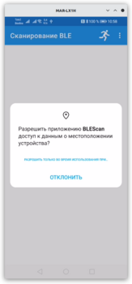
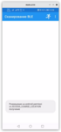
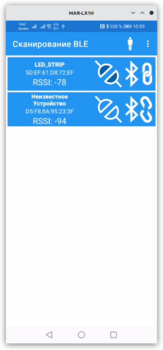
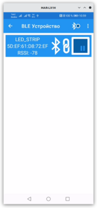
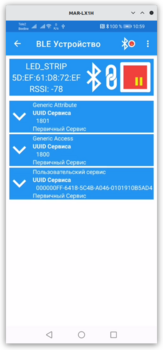
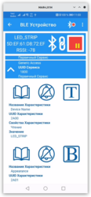
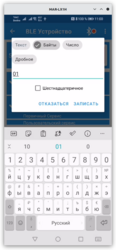

# Простейший сканнер BLE


## Внешний вид программы








## Зачем?

### Что уже есть?

[NordicSemiconductor Android BLE Library](https://github.com/NordicSemiconductor/Android-BLE-Library/) полностью устраивает большую часть разработчиков интерфейсов c BLE. Эта библиотека достаточно просто позволяет решить большую часть проблем, работы со стеком BLE на платформе Android. 


Также, есть прекрасная облегчённая библиотека Мартина Велле [BLESSED](https://github.com/weliem/blessed-android) написанная на Java
и аналогичная версия на Kotlin [Coroutines BLESSED](https://github.com/weliem/blessed-android-coroutines)


Живая и вполне поддерживаемая небольшая библиотека [https://github.com/niedev/BluetoothCommunicator](BluetoothCommunicator)

Одним словом, есть вполне работоспособные и действующие проекты, которые в значительной степени избавляют от необходимости изобретения очередного велосипеда и серии самоподрывов в собственном приложении из-за багов библиотеки BLE, накладывающихся на баги интерфейса.

Просмотр кода библиотеки [NordicSemiconductor Android BLE Library](https://github.com/NordicSemiconductor/Android-BLE-Library/) быстро отрезвляет и приводит к выводу, что лучше пользоваться громоздким, сложным, но уже готовым, чем изобретать велосипед. Создание собственной библиотеки BLE имеет, скорее учебное значение, нежели практическое применение. Однако, своей библиотекой [BLIN](https://github.com/GrandFatherPikhto/BLEScan/tree/master/blin) интерсивно пользуюсь в собственных разработках. Например, для создания интерфейсов управления микропроцессорными устройствами на базе [ESP32](https://www.espressif.com), [STM32](https://st.com) [PIC, AVE](https://www.microchip.com//) и т.д.


### Траблы (Issues)

Что касается 'нативого' стека BLE, с ним, по ряду вполне понятных причин, среди разработчиков мало кто хочет связываться. За десять лет 'нарисовался' изрядный список, порой, довольно странных сложностей (Issues), которые неизбежно возникают при создании собственного стека работы с BLE Android и которые сама компания Google, похоже исправлять не собирается от слова "совсем". К сожалению, официальном руководстве [Android BLE](https://developer.android.com/guide/topics/connectivity/bluetooth/ble-overview) об этом списке проблем почти ничего не говорится.

К примеру,
[проблема работы фильтров при сканировании BLE устройств](https://stackoverflow.com/questions/34065210/android-ble-device-scan-with-filter-is-not-working/34092300), так до сих пор и не решена на многих устройствах.

[В официальном руководстве](https://android-doc.github.io/guide/topics/connectivity/bluetooth-le.html) ничего не сказано о том, что не существует какого либо специального флага уведомлений о том, что характеристика работает в режиме ответа на запись (notification). Вам надо самим создать список характеристик, которые переведены в режим 'NOTIFICATION' и не забыть их вернуть в обычный режим по окончании работы приложения.
То есть сам-то метод есть [setCharacteristicNotification(BluetoothGattCharacteristic characteristic, Boolean enable)](https://developer.android.com/reference/android/bluetooth/BluetoothGatt#setCharacteristicNotification(android.bluetooth.BluetoothGattCharacteristic,%20boolean)), конечно, есть. Но толку от него мало, если Вы вручную не поменяете значение соответствующей notification/indication характеристики.

```Kotlin
    @SuppressLint("MissingPermission")
    private fun enableNotifyCharacteristic(bluetoothGattCharacteristic: BluetoothGattCharacteristic) {
        bluetoothGatt?.let { gatt ->
            bluetoothGattCharacteristic.getDescriptor(NOTIFY_DESCRIPTOR_UUID)
                ?.let { bluetoothGattDescriptor ->
                    gatt.setCharacteristicNotification(bluetoothGattCharacteristic, true)
                    bluetoothGattDescriptor.value =
                        BluetoothGattDescriptor.ENABLE_NOTIFICATION_VALUE
                    writeGattData(GattData(bluetoothGattDescriptor))
                }
        }
    }

    @SuppressLint("MissingPermission")
    fun notifyCharacteristic(bluetoothGattCharacteristic: BluetoothGattCharacteristic) {
        if (isCharacteristicNotified(bluetoothGattCharacteristic)) {
            disableNotifyCharacteristic(bluetoothGattCharacteristic)
        } else {
            enableNotifyCharacteristic(bluetoothGattCharacteristic)
        }
    }
```

И чтобы отследить изменения состояния Характеристики, нужно добавить слежение за изменением значений соответствующего дескриптора

```val NOTIFY_DESCRIPTOR_UUID = UUID.fromString("00002902-0000-1000-8000-00805f9b34fb".uppercase())```

Потому что, штатный метод [public void onCharacteristicChanged (BluetoothGatt gatt, 
                BluetoothGattCharacteristic characteristic, 
                byte[] value)](https://developer.android.com/reference/android/bluetooth/BluetoothGattCallback#onCharacteristicChanged(android.bluetooth.BluetoothGatt,%20android.bluetooth.BluetoothGattCharacteristic,%20byte[])) срабатывает *только*, когда уведомления или индикация *включены*.

Так, что придётся отлавливать изменения режима при помощи функции [public void onDescriptorRead (BluetoothGatt gatt, 
                BluetoothGattDescriptor descriptor, 
                int status, 
                byte[] value)](https://developer.android.com/reference/android/bluetooth/BluetoothGattCallback#onDescriptorRead(android.bluetooth.BluetoothGatt,%20android.bluetooth.BluetoothGattDescriptor,%20int,%20byte[])) и соорудить что-то вроде

```Kotlin
private fun onDescriptorWrite(gatt : BluetoothGatt?, descriptor: BluetoothGattDescriptor?, ) {
   if (gatt != null && descriptor != null && descriptor.uuid == NOTIFY_DESCRIPTOR_UUID) {
       val notify = ByteBuffer
           .wrap(bluetoothGattDescriptor.value)
           .order(ByteOrder.LITTLE_ENDIAN).short.toInt()
       when(notify) {
           0 -> {
               if (isCharacteristicNotified(bluetoothGattDescriptor.characteristic)) {
                   Log.d(tagLog, "onCharacteristicChanged(${bluetoothGattDescriptor.characteristic.uuid}, notifyDisable)")
                   mutableListNotifiedCharacteristic.remove(bluetoothGattDescriptor.characteristic)
                   mutableSharedFlowCharacteristicNotify
                       .tryEmit(BleCharacteristicNotify(bluetoothGattDescriptor.characteristic.uuid, false))
               }
           }
           1 -> {
               if (!isCharacteristicNotified(bluetoothGattDescriptor.characteristic)) {
                   Log.d(tagLog, "onCharacteristicChanged(${bluetoothGattDescriptor.characteristic.uuid}, notifyEnable)")
                   mutableListNotifiedCharacteristic.add(bluetoothGattDescriptor.characteristic)
                   mutableSharedFlowCharacteristicNotify
                       .tryEmit(BleCharacteristicNotify(bluetoothGattDescriptor.characteristic.uuid, true))
               }
           }
           2 -> {


           }
           else -> {


           }
       }
   }
}
```                
Что до подключения к BLE-устройству, тот этот момент, вообще, окутан какой-то невероятно густой и совершенно невнятной мистикой. Цитирую дословно [Мартина Велле](https://medium.com/@martijn.van.welie/making-android-ble-work-part-2-47a3cdaade07): «Чтобы узнать, было ли кэшировано устройство, вы можете использовать небольшой трюк. После создания BluetoothDevice вы должны сделать это, getType()и если он вернется TYPE_UNKNOWN, устройство явно не кэшируется. Если это так, вы должны сначала просканировать устройство с этим mac-адресом (используя неагрессивный режим сканирования), а после этого вы можете снова использовать автоподключение»

То есть, что-то такое:

```Kotlin
    @SuppressLint("MissingPermission")
    private fun connect(address: String) : BluetoothGatt? {
        bleManager.bluetoothAdapter.getRemoteDevice(address)?.let { bluetoothDevice ->
            return device.connectGatt(
                bleManager.applicationContext,
                device.type == BluetoothDevice.DEVICE_TYPE_UNKNOWN,
                bleGattCallback,
                BluetoothDevice.TRANSPORT_LE
            )
        }

        return null
    }
```

То есть, строчка ```device.type == BluetoothDevice.DEVICE_TYPE_UNKNOWN```, как бы ни из чего, кроме некоторых частных руководств, вообще ни из чего не следует.

Вообще, возврат ошибок 133/6 при переподключении в штатном описании 133-й ошибки, вообще отсутствует. Есть одинокая константа в файле [gatt_api.h](https://android.googlesource.com/platform/external/bluetooth/bluedroid/+/adc9f28ad418356cb81640059b59eee4d862e6b4/stack/include/gatt_api.h#54)

```#define  GATT_ERROR                          0x85```

[Мартин Веллие](https://medium.com/@martijn.van.welie/making-android-ble-work-part-2-47a3cdaade07) пишет, что при возврате такой ошибки надо пересканировать устройство и повторить попытку подключения.

Буфферы обмена надо делать самому. И, в данной ситуации это даже хорошо. Можно реализовать фичи, вроде Back-pressure и т.д.

Про [Knox-проблемы](https://docs.samsungknox.com/dev/knox-sdk/bluetooth-support.htm), которые получаются в жизни корейских устройств можно написать целую книгу.

Известная умолчанка про нерабочие фильтры [BluetoothLeScanner](https://developer.android.com/reference/android/bluetooth/le/BluetoothLeScanner) висит в списке issues уже лет десять. Так же, официально не заявлено, что при шестикратном повторном запуске сканирования, сканирование вообще блокируется на минуту.

Штатный [ScanCallback](https://developer.android.com/reference/android/bluetooth/le/ScanCallback) вообще не возвращает никаких ошибок, кроме сообщения в консоли отладчика, типа 

```D/BluetoothLeScanner: onScannerRegistered() - status=6 scannerId=-1 mScannerId=0```

Отловить эту ошибку фактически невозможно. Можете сами убедиться. Код предельно простой:
```Kotlin
repeat(6) {
            runBlocking {
                startScan()
                delay(100)
                stopScan()
            }
        }
```

*Однако*, несмотря на груз ошибок и недоработок, иногда бывает нужно сделать что-то совершенно своё, особенное. Для этого надо хорошее понимание основных проблемм работы со стеком BLE и умение с ним обращаться. Например, захотелось триангулировать своё положение при помощи стека BLE. Возможно? Вполне. Например, [Determining the Proximity to an iBeacon Device](https://developer.apple.com/documentation/corelocation/determining_the_proximity_to_an_ibeacon_device)

## Как?

*Чисто писано в бумаге, да забыли про овраги, как по ним ходить © Лев Николаевич Толстой*

Что есть в помощь из самого фундаментального (Where to Go From Here?):

Официальная документация по стеку [Bluetooth LE](https://developer.android.com/guide/topics/connectivity/bluetooth/ble-overview) Android написана внятно и прозрачно. Однако, существует содержит длинный, список упорно не исправляемых разработчиками проблем (Issues). Если хотите, загляните в финал документа, там есть несколько ссылок, в т.ч. [Android BLE Issues от Google](https://support.google.com/android/answer/9769184?hl=en).

Однако, список не документированных проблем достаточно длинный. Скажем, вполне опрятный список есть у [SweetBlue Android BLE Issues](https://sweetblue.io/docs/Android-BLE-Issues)

Наконец, самый толковый документ для начинающего BLE-разработчика — это цикл статей Мартина ван Велле:

1. [Making Android BLE work — part 1 // Martin van Welie](https://medium.com/@martijn.van.welie/making-android-ble-work-part-1-a736dcd53b02?source=user_profile---------3-------------------------------) Часть 1. Как заставить Android BLE работать - часть 1
2. [Making Android BLE work — part 2 // Martin van Welie](https://medium.com/@martijn.van.welie/making-android-ble-work-part-2-47a3cdaade07?source=user_profile---------2-------------------------------) Часть 2. Подключение, отключение, исследование сервисов
3. [Making Android BLE work — part 3 // Martin van Welie](https://medium.com/@martijn.van.welie/making-android-ble-work-part-3-117d3a8aee23?source=user_profile---------1-------------------------------) Часть 3. чтение/запись характеристик; включение/выключение уведомлений
4. [Making Android BLE work — part 4 // Martin van Welie](https://medium.com/@martijn.van.welie/making-android-ble-work-part-4-72a0b85cb442?source=user_profile---------0-------------------------------) Часть 4. Сопряжение с устройствами

Есть вполне нормальный перевод этого цикла на Хабре:

1. [Перевод статьи Мартина ван Велле](https://habr.com/ru/post/536392/) Часть 1. Сканирование
2. [Перевод статьи Мартина ван Велле](https://habr.com/ru/post/537526/) Часть 2. Подключение/Отключение
3. [Перевод статьи Мартина ван Велле](https://habr.com/ru/post/538768/) Часть 3. Чтение/Запись характеристик
4. [Перевод статьи Мартина ван Велле](https://habr.com/ru/post/539740/) Часть 4. Сопряжение устройств

Существует небольшой, но очень дельный ~~китаёзный~~ гайд [Chee Yi Ong](https://punchthrough.com/author/cong/) — [The Ultimate Guide to Android Bluetooth Low Energy](https://punchthrough.com/android-ble-guide/). Настоятельно рекомендую для чтения, если Вы всё-таки решили «залезть» в тему BLE.

Можно с уверенностью утверждать, что если Вы будете следовать в разработке своей библиотеки рекомендациям эти руководства, Ваше приложение будет работать хотя бы на 80% современных мобильных устройств, учитывая что особо не хочется поддерживать всё, что ниже версии Marshmallow (хотя, это не так уж и трудно — описано довольно подробно) и на 12-й версии описывают какие-то трудно объяснимые проблемы.

В частности, [Android 12 Новые разрешения Bluetooth](https://stackoverflow.com/questions/67722950/android-12-new-bluetooth-permissions). Однако, утверждается, что эти проблемы исправлены. Нет гарантии, что не возникнут новые.

### Самые известные проблемы

Пожалуй, основная проблема BLE — это нестабильный процесс подключения к устройству

1. [BluetoothGatt.discoverServices](https://developer.android.com/reference/android/bluetooth/BluetoothGatt#discoverServices())
   Довольно часто возвращает `false`. Некоторые попытки сниффинга обмена данными по Bluetooth говорят о нарушениях протокола Bluetooth 4+ в ОС Android. Самый простой способ, предложенный, опять-таки [Nordic-Semiconductor](), быстрое сканирование устройства с фильтром по адресу и повторная попытка подключения. Согласно официальному руководству, за 30 секунд у нас всего 5 попыток. После этого устройство блокируется системой примерно на 1 минуту.

2. [BluetoothDevice.connectGatt](https://developer.android.com/reference/android/bluetooth/BluetoothDevice#connectGatt(android.content.Context,%20boolean,%20android.bluetooth.BluetoothGattCallback)) при неправильном использовании параметра `autoConnect` так же может вернуть ошибку со статусом **6** или **131** (плохо объяснённые в официальном руководстве). Причём правильное значение параметра, `autoConnect`, зависит от версии Android и модели мобильного телефона. Недокументированная мистика!
   Штатное решение, придуманное программистами NordicSemiconductor: в качестве значения `autoConnect` использовать `bluetoothDevice!!.type == luetoothDevice.DEVICE_TYPE_UNKNOWN`. Подробнее, см. [Martin van Wellie // Making Android BLE work — part 2](https://medium.com/@martijn.van.welie/making-android-ble-work-part-2-47a3cdaade07?source=user_profile---------2-------------------------------)

3. [BluetoothGattCallback.onConnectionStateChange](https://stackoverflow.com/questions/38666462/android-catching-ble-connection-fails-disconnects) не всегда срабатывает при отключении устройства, если скажем, оно не сопряжено с телефоном (некоторые устройства без сопряжения автоматически  разрывают связь через 30 секунд) Поэтому, надо устанавливать ожидание сообщения об отключении, перед тем, как закрыть приложение. Иначе, стек переполнится и устройство будет всё-время возвращать 6/133. Придётся очищать стек подключения (Настройки/Приложения/Показать Системны/Bluetooth/Очистить память, перезагрузка устройства)

4. Количество [разрешений](https://developer.android.com/reference/android/Manifest.permission), необходимых для [включения/выключения, сканирования, считывания рекламы](https://developer.android.com/guide/topics/connectivity/bluetooth/permissions) [`Bluetooth`](https://developer.android.com/guide/topics/connectivity/bluetooth), [BLE](https://developer.android.com/guide/topics/connectivity/bluetooth/ble-overview), постоянно растёт от одной версии к другой. И с каждой версией список только растёт.

5. Как уже и было сказано, режим фильтрации сканирования по адресу на многих устройствах до сих пор не работает. По какой-то причине этот дефект не устранён за последние... да лет пять тому, как, чтобы не соврать. Поэтому, нужно делать свой фильтр, что совсем не сложно, но не понятно, почему до сих пор не реализован в `штатном` режиме?

## Структура программы

### [MainActivity](./app/src/main/java/com/grandfatherpikhto/blescan/MainActivity.kt)

Здесь происходит запрос на привязывание/отвязывание сервиса, запрос необходимых разрешений, запрос на включение/выключение адаптера Bluetooth. Здесь же происходит навигация по фрагментам: [ScanFragment]() и [DeviceFragment]().

Начнём с запроса разрешений на доступ к сканированию, подключению, сопряжению и обмен данными с Bluetooth:

```xml
<manifest>
    <!-- Запросить устаревшие разрешения Bluetooth на старых устройствах -->
    <uses-permission android:name="android.permission.BLUETOOTH"
        android:maxSdkVersion="30" />
    <uses-permission android:name="android.permission.BLUETOOTH_ADMIN"
        android:maxSdkVersion="30" />

    <!-- Требуется только в том случае, если ваше приложение ищет устройства Bluetooth.
         Если ваше приложение не использует результаты сканирования Bluetooth для получения
         информации о физическом местоположении, вы можете твердо утверждать,
         что ваше приложение не определяет физическое местоположение. -->
    <uses-permission android:name="android.permission.BLUETOOTH_SCAN" />

    <!-- Требуется только в том случае, если ваше приложение позволяет обнаруживать устройство для
         устройств Bluetooth. -->
    <uses-permission android:name="android.permission.BLUETOOTH_ADVERTISE" />

    <!-- Требуется только в том случае, если ваше приложение обменивается данными с уже сопряженными
         устройствами Bluetooth.. -->
    <uses-permission android:name="android.permission.BLUETOOTH_CONNECT" />

    <!-- Требуется только в том случае, если ваше приложение использует результаты сканирования
         Bluetooth для определения физического местоположения. -->
    <uses-permission android:name="android.permission.ACCESS_FINE_LOCATION" />
    ...
</manifest>
```

На первых порах, некое изумление вызвает необходимость давать разрешение на локацию. Но это ничего, со временем привыкаешь и начинаешь более ли менее понимать логику системы. Запрос на доступ к локации, относится к уровню `dangerous` и требует программного запроса на доступ.

Запросы уровня `dangerous`: [android.permission.ACCESS_FINE_LOCATION](https://developer.android.com/reference/android/Manifest.permission#ACCESS_FINE_LOCATION), [android.permission.ACCESS_COARSE_LOCATION](https://developer.android.com/reference/android/Manifest.permission#ACCESS_COARSE_LOCATION), [android.permission.ACCESS_BACKGROUND_LOCATION](https://developer.android.com/reference/android/Manifest.permission#ACCESS_COARSE_LOCATION) нужно запрашивать напрямую, скажем, из `Активности`. Причём, ланчеры запросов надо создать до формирования самой `Активности`, иначе мы сможем запрашивать разрешения или запрос на включение/выключение Bluetooth только в процессе запуска приложения.

```kotlin
    /**
     * Запрос группы разрешений
     * Ланчер необходимо вынести в глобальные переменные, потому что
     * он должен быть инициализирован ДО запуска Активности.
     * В противном случае, будет ошибка запроса, если мы вздумаем
     * перезапросить разрешения после запуска полного запуска приложения
     */
    private val permissionsLauncher =
        registerForActivityResult(
            ActivityResultContracts.RequestMultiplePermissions()) { results ->
            results?.entries?.forEach { result ->
                val name = result.key
                val isGranted = result.value
                if (isGranted) {
                    Toast.makeText(this, "Разрешение на $name получено", Toast.LENGTH_SHORT)
                        .show()
                    mainActivityModel.andReady(true)
                } else {
                    Toast.makeText(this, "Разрешение на $name не дано", Toast.LENGTH_SHORT)
                        .show()
                    mainActivityModel.andReady(false)
                }
            }
        }

    /**
     * Ланчер для запроса на включение bluetooth
     * Тоже самое: ланчер надо вынести в глобальные переменные,
     * чтобы он инициализировался ДО запуска Активности.
     * Иначе, после старта виджета перезапросить включение Блютуз
     * уже не получится
     */
    private val bluetoothLauncher
            = registerForActivityResult(
        ActivityResultContracts.StartActivityForResult()) { result ->
        if(result.resultCode == RESULT_OK) {
            mainActivityModel.andReady(true)
        } else {
            mainActivityModel.andReady(false)
        }
    }
```

Теперь можно сделать пару функций для запросов разрешений и на включение Bluetooth.

```kotlin
    /**
     * Запрос на включение Bluetooth
     */
    private fun requestEnableBluetooth() {
        val enableBtIntent = Intent(BluetoothAdapter.ACTION_REQUEST_ENABLE)
        bluetoothLauncher.launch(enableBtIntent)
    }

    /**
     * Запрос группы разрешений
     */
    private fun requestPermissions(permissions: Array<String>) {
        val launchPermissions:MutableList<String> = mutableListOf<String>()

        permissions.forEach { permission ->
            if (ContextCompat.checkSelfPermission(
                    this,
                    permission
                ) == PackageManager.PERMISSION_GRANTED
            ) {
                mainActivityModel.andReady(true)
            } else {
                launchPermissions.add(permission)
            }
        }

        if(launchPermissions.isNotEmpty()) {
            permissionsLauncher.launch(launchPermissions.toTypedArray())
        }
    }
```

Например, можно запрашивать разрешения на доступ при запуске приложения, а запрос на включение/выключение адаптера Bluetooth, «повесить» на опцию главного меню.

Привязывание сервисов так же находится здесь, чтобы согласовать жизненный цикл активности и работы сервиса. Строго говоря, этого можно и не делать и перенести привязывание сервиса в класс наследованный от [Application](https://developer.android.com/reference/android/app/Application) [BleScanApp](./app/src/main/java/com/grandfatherpikhto/blescan/BleScanApp.kt), или вовсе отказаться от сервиса, как от ненужного костыля.

Чтобы [BleScanApp](./app/src/main/java/com/grandfatherpikhto/blescan/BleScanApp.kt) создавался, нужно указать его в [AndroidManifext.xml](./app/src/main/AndroidManifest.xml)


```xml
<application>
    <service android:name=".service.BtLeService" android:enabled="true" />
</application>
```

В этой реализации сервис привязан к жизненному циклу [MainActivity](./app/src/main/java/com/grandfatherpikhto/blescan/MainActivity.kt) и отвязывается c отключением от устройства при каждом повороте экрана или переходе приложения в фоновый режим:

```kotlin
    /**
     * Событие жизненного цикла Activity() onPause()
     */
    override fun onPause() {
        super.onPause()
        unbindService(btLeServiceConnector)
    }

    /**
     * Событие жизненного цикла Activity() onResume()
     */
    override fun onResume() {
        super.onResume()
        Intent(this, BtLeService::class.java).also { intent ->
            bindService(intent, btLeServiceConnector, Context.BIND_AUTO_CREATE)
        }
    }
```

#### Навигация фрагментов

В этом примере навигация сделана довольно грубо. В [MainActivity](./app/src/main/java/com/grandfatherpikhto/blescan/MainActivity.kt)
создан `enum class Current`, значения которого указывают на объекты навигации из
[nav_graph.xml](./app/src/main/res/navigation/nav_graph.xml)

```kotlin
    enum class Current (val value: Int) {
        None(0x00),
        Scanner(R.id.ScanFragment),
        Device(R.id.DeviceFragment)
    }
```

Объект [MutableLiveData](https://developer.android.com/reference/androidx/lifecycle/MutableLiveData) в
модели [MainActivityModel](./app/src/main/java/com/grandfatherpikhto/blescan/model/MainActivityModel.kt)
хранит идентификатор текущего активного фрейма:

```kotlin
    private val _current = MutableLiveData<MainActivity.Current>(MainActivity.Current.Scanner)
    val current:LiveData<MainActivity.Current> = _current

    fun changeCurrent(value: MainActivity.Current) {
        _current.postValue(value)
    }
```

Всё, что остаётся — просто менять запись на нужное значение и, соответственно, переключаться между
[ScanFragment](./app/src/main/java/com/grandfatherpikhto/blescan/ScanFragment.kt) и
[DeviceFragment](./app/src/main/java/com/grandfatherpikhto/blescan/DeviceFragment.kt). Текущий фрагмент хранится в модели, так что при повороте экрана или уходе приложения в фоновый режим, будет восстанавливаться выбранный фрагмент.

События запуска сканирования и подключения к устройству обрабатываются внутри фрагментов.

Важно, что по-умолчанию генератор приложения AndroidStudio `Basic Activity` создаёт тэг `fragment`

```xml
    <fragment
        android:id="@+id/nav_host_fragment_content_main"
        android:name="androidx.navigation.fragment.NavHostFragment"
        android:layout_width="0dp"
        android:layout_height="0dp"
        app:defaultNavHost="true"
        app:layout_constraintBottom_toBottomOf="parent"
        app:layout_constraintLeft_toLeftOf="parent"
        app:layout_constraintRight_toRightOf="parent"
        app:layout_constraintTop_toTopOf="parent"
        app:navGraph="@navigation/nav_graph" />

```

Однако, этот тэг является устаревшим и если последовать совету автокорректировщика

```text
Use FragmentContainerView instead of the <fragment> tag

Replace the <fragment> tag with FragmentContainerView.

FragmentContainerView replaces the <fragment> tag as the preferred way of adding fragments via XML.
Unlike the <fragment> tag, FragmentContainerView uses a normal FragmentTransaction under the hood
to add the initial fragment, allowing further FragmentTransaction operations on the
FragmentContainerView and providing a consistent timing for lifecycle events. 
Issue id: FragmentTagUsage
https://developer.android.com/reference/androidx/fragment/app/FragmentContainerView.html
Vendor: Android Open Source Project (fragment-1.3.6)
Identifier: fragment-1.3.6 Feedback: https://issuetracker.google.com/issues/new?component=192731

Fix: Replace with androidx.fragment.app.FragmentContainerView 
```

И заменить &lt;fragment&gt; на &lt;FragmentContainerView&gt;

```xml
    <androidx.fragment.app.FragmentContainerView
        android:id="@+id/nav_host_fragment_content_main"
        android:name="androidx.navigation.fragment.NavHostFragment"
        android:layout_width="0dp"
        android:layout_height="0dp"
        app:defaultNavHost="true"
        app:layout_constraintBottom_toBottomOf="parent"
        app:layout_constraintLeft_toLeftOf="parent"
        app:layout_constraintRight_toRightOf="parent"
        app:layout_constraintTop_toTopOf="parent"
        app:navGraph="@navigation/nav_graph" />
```

Штатный код вызова
[findNavController](https://developer.android.com/reference/androidx/navigation/Navigation#findNavController(android.app.Activity,kotlin.Int))

```kotlin
        val navController = findNavController(R.id.nav_host_fragment_content_main)
        appBarConfiguration = AppBarConfiguration(navController.graph)
        setupActionBarWithNavController(navController, appBarConfiguration)
```

Работать уже не будет. Так, что его надо заменить на обращение к
[supportFragmentManager](https://developer.android.com/reference/androidx/fragment/app/FragmentActivity#getSupportFragmentManager())
(см. [Navigation](https://developer.android.com/guide/navigation))

```kotlin
    private fun bindNavBar() {
        val navHostFragment = supportFragmentManager.findFragmentById(R.id.nav_host_fragment_content_main) as NavHostFragment
        val navController = navHostFragment?.findNavController()
        if(navController != null) {
            appBarConfiguration = AppBarConfiguration(navController.graph)
            setupActionBarWithNavController(navController, appBarConfiguration)
        }
    }
```

И навигация по фрагментам тогда будет работать так:

```kotlin
    private fun doNavigate(current: Current) {
        val navHostFragment = supportFragmentManager.findFragmentById(R.id.nav_host_fragment_content_main) as NavHostFragment
        val navController = navHostFragment?.findNavController()
        if(navController.currentDestination?.id != current.value) {
            navController.navigate(current.value)
        }
    }
```

Осталось «привязать» изменения значения поля `current` в модели `MainActivityModel` к навигации по текущему фрагменту:

```kotlin
        mainActivityModel.current.observe(this, { current ->
            doNavigate(current)
        })
```

### [ScanFragment](https://github.com/GrandFatherPikhto/BLEScan/blob/master/app/src/main/java/com/grandfatherpikhto/blescan/ScanFragment.kt)

«Умолчальный» фрагмент, с которого начинается запуск приложения (Home в nav_graph).

Запускается первым. Контейнер для списка найденных устройств. Использует [RecycleView](https://developer.android.com/reference/androidx/recyclerview/widget/RecyclerView), в простейшем варианте. Для его работы создан небольшой адаптер [RvBtAdapter](https://github.com/GrandFatherPikhto/BLEScan/blob/master/app/src/main/java/com/grandfatherpikhto/blescan/adapter/RvBtAdapter.kt). Адаптер сделан очень просто, буквально по [официальному руководству](https://developer.android.com/guide/topics/ui/layout/recyclerview). Так, что подробно описывать его здесь не будем.

Может быть, не стоило валить в одну кучу все данные сканирования устройств и подключения в одну модель, но данный пример невелик, поэтому, данные сканирования и подключения находятся в [BtLeModel](./app/src/main/java/com/grandfatherpikhto/blescan/model/BtLeModel.kt)

Устройства хранятся в списке, причём, по каждому новому устройству идёт сигнал обновления всего списка. Это не красиво, но больше вряд ли в списке будет больше 20 устройств, поэтому, в модели сделано так:

```kotlin
        override fun onFindDevice(btLeDevice: BtLeDevice?) {
            super.onFindDevice(btLeDevice)
            _device.postValue(btLeDevice)
            btLeDevice?.let { found ->
                devicesList.add(found)
                _devices.postValue(devicesList)
            }
        }
```

В свою очередь, [ScanFragment](./app/src/main/java/com/grandfatherpikhto/blescan/ScanFragment.kt) просто отслеживает содержимое списка:

```kotlin
    private fun bindRvAdapter () {
        binding.apply {
            rvBtList.adapter = rvBtAdapter
            rvBtList.layoutManager = LinearLayoutManager(requireContext())
            if(btLeModel.devices != null) {
                rvBtAdapter.setBtDevices(btLeModel.devices.value!!.toSet())
            }

            btLeModel.devices.observe(viewLifecycleOwner, { devices ->
                rvBtAdapter.setBtDevices(devices.toSet())
            })
            btLeModel.bond.observe(viewLifecycleOwner, { isBond ->
                // btLeScanService = BtLeScanServiceConnector.service
                // btLeScanService?.scanLeDevices(name = AppConst.DEFAULT_NAME)
            })
        }
    }
```

Состояния — сканирование, остановка сканирования, получение списка сопряжённых устройств, так же хранятся в [BtLeModel](https://github.com/GrandFatherPikhto/BLEScan/blob/master/app/src/main/java/com/grandfatherpikhto/blescan/model/BtLeModel.kt).

```kotlin
    /**
     * Следит за изменением LiveData переменной Action.
     * Запускает/останавливает сканирование или выводит
     * список сопряжённых устройств
     * Обрабатывается, только когда сервис уже привязан к
     * Активности!
     */
    private fun bindAction (view: View) {
        Log.d(TAG, "bindAction, bond = true")
        btLeModel.action.observe(viewLifecycleOwner, { action ->
            Log.d(TAG, "bindAction: $action")
            when(action) {
                Action.None -> {
                    bluetoothInterface.stopScan()
                }
                Action.Scan -> {
                    Log.d(TAG, "Action: $action")
                    btLeModel.clean()
                    bluetoothInterface.leScanDevices(names = settings.getString("names_filter", ""),
                    addresses = settings.getString("addresses_filter", ""))
                }
                Action.Paired -> {
                    btLeModel.clean()
                    bluetoothInterface.stopScan()
                    bluetoothInterface.pairedDevices()
                }
                else -> {}
            }
        })
    }
```

Короткий клик по плашке найденного устройства останавливает текущее сканирование и запускает повторное сканирование с фильтром по адресу устройства. Сделано просто так, для проверки работы фильтра.

```kotlin
    private fun initRvAdapter() {
        rvBtAdapter.setOnItemClickListener(object : RvItemClick<BtLeDevice> {
            override fun onItemClick(model: BtLeDevice, view: View) {
                Toast.makeText(
                    requireContext(),
                    "Сканируем адрес ${model.address}",
                    Toast.LENGTH_LONG).show()
                bluetoothInterface.stopScan()
                btLeModel.clean()
                bluetoothInterface.leScanDevices(addresses = model.address, mode = BtLeScanner.Mode.StopOnFind)
            }

            override fun onItemLongClick(model: BtLeDevice, view: View) {
                Toast.makeText(
                    requireContext(),
                    "Подключаемся к ${model.address}",
                    Toast.LENGTH_LONG).show()
                connectToBluetoothDevice(model)
            }
        })

        bindRvAdapter()
    }
```

Длительный клик — попытка подключения к устройству. Это передаётся в главную модель [MainActivityModel](https://github.com/GrandFatherPikhto/BLEScan/blob/master/app/src/main/java/com/grandfatherpikhto/blescan/model/MainActivityModel.kt). Поскольку, она общая для Главной Активности и всех фрагментов. Экземпляр модели Главной Активности вызывается при помощи `private val mainActivityModel:MainActivityModel by activityViewModels()`, а значит, это — синглетон

```kotlin
    private fun connectToBluetoothDevice(model: BtLeDevice) {
        mainActivityModel.changeDevice(model)
        mainActivityModel.changeCurrent(MainActivity.Current.Device)
    }
```

Главная Активность следит за `current` и переключает текующий фрагмент на [DeviceFragment](https://github.com/GrandFatherPikhto/BLEScan/blob/master/app/src/main/java/com/grandfatherpikhto/blescan/DeviceFragment.kt)

Длительное нажатие на плашку найденного устройства активирует попытку подключения к устройству.

### [DeviceFragment](./app/src/main/java/com/grandfatherpikhto/blescan/DeviceFragment.kt)

Фактически, это тоже контейнер для [RecycleView](https://developer.android.com/reference/androidx/recyclerview/widget/RecyclerView) с адаптером [RvGattAdapter](./app/src/main/java/com/grandfatherpikhto/blescan/adapter/RvGattAdapter.kt). После исследования `GATT`, прокручивается простой цикл:

```kotlin
        btLeModel.gatt.observe(viewLifecycleOwner, { gatt ->
            gatt?.let { rvGattAdapter.setGatt(it) }
            gatt?.services?.forEach { service ->
                Log.d(TAG, "Service: ${service.uuid} ${service.type}")
                service?.characteristics?.forEach { characteristic ->
                    Log.d(TAG, "Characteristic: ${characteristic.uuid} ${characteristic.properties}")
                    characteristic?.descriptors?.forEach { descriptor ->
                        Log.d(TAG, "Descriptor: ${descriptor.uuid}")
                    }
                }
            }
        })
```

и список заполняется значениями сервисов, характеристик и дескрипторов. Чтобы не усложнять работу списка здесь не реализована псевдодревовидная структура отображения, хотя это не так уж сложно и для этого вовсе не надо реализовывать вложенные списки. Достаточно просто перехватить вызов

```kotlin
    override fun getItemViewType(position: Int): Int {
        // return super.getItemViewType(position)
        return profile[position].first.value
    }
```

и в `bind` привязывать разные плашки, с разным отступом и разным содержимым. Впрочем, Вы это можете реализовать самостоятельно.

### Сервис [BtLeService](./app/src/main/java/com/grandfatherpikhto/blescan/service/BtLeService.kt)

Прежде всего, обмен данными между сервисом и приложениями достаточно... нет, не сложен, но несколько осложнён. Это можно сделать пятью способами:

### Передачу данных между сервисами и виджетами можно организовать аж семью способами

1. Можно создать широковещательные приемники/передатчики и рассылать/получать уведомления.
   при помощи [Broadcastreceiver](https://developer.android.com/reference/android/content/BroadcastReceiver),
   [IntentFilter](https://developer.android.com/reference/android/content/IntentFilter),
   [sendBroadcast](https://developer.android.com/reference/android/content/Context#sendBroadcast(android.content.Intent)),
   как это достаточно подробно описано в примерах [broadcasts](https://developer.android.com/guide/components/broadcasts).

```java
Intent intent = new Intent("com.grandfatherpikhto.blescan.NEW_DEVICE_DETECTED");
// Intent intent = new Intent();
// intent.setAction("com.grandfatherpikhto.blescan.NEW_DEVICE_DETECTED");

intent.putExtra("device", device.name);
intent.putExtra("address", device.address);
intent.putExtra("bond", device.getBondState());
sendBroadcast(intent);
```

```kotlin
Intent().also { intent ->
    intent.setAction("com.grandfatherpikhto.blescan.NEW_DEVICE_DETECTED")
    intent.putExtra("device", device.name);
    intent.putExtra("address", device.address);
    intent.putExtra("bond", device.bondState);
    sendBroadcast(intent)
}
```

И не забыть добавить описание сообщений в [AndroidManifest.xml](./app/src/main/AndroidManifest.xml)

```xml
<receiver android:name=".MyBroadcastReceiver"  android:exported="true">
   <intent-filter>
      <action android:name="com.grandfatherpikhto.blescan.NEW_DEVICE_DETECTED"/>
   </intent-filter>
</receiver>
```

У широковещательного приёмника/передатчик два основных недостатка
а. Нельзя быстро передавать объекты и скорость передачи относительно невысока, а нагрузка на Android при больших потоках данных, возрастает.
б. Можно передавать только простые данные. Такие, как `String`, `Int`, `Float` и т.д.

2. Если бы нагрузка была небольшой, можно было бы использовать [Preferences](https://developer.android.com/reference/androidx/preference/package-summary). Однако, если, например, нужно управлять устройством, типа Адресной Светодиодной Лентой, поток данных будет значительным и хотелось бы, чтобы задержка при передаче данных была бы минимальной. Этот способ не подойдёт.

3. Для кратковременного совместного использования сложных непостоянных определенных пользователем объектов можно использовать синглетон приложений. Класс [android.app.Application](https://developer.android.com/reference/android/app/Application).

   Он имеет несколько методов жизненного цикла и будет автоматически создан `Android`, если зарегистрировать его в [AndroidManifest.xml](./app/src/main/AndroidManifest.xml):

```xml
  <application
      android:name=".BLEScanApp">

  </application>
```

Доступ к синглетону приложения можно получить через [getApplication()](https://developer.android.com/reference/android/app/Activity#getApplication())  из любого действия или из [службы](https://developer.android.com/reference/android/app/Service#getApplication()).

4. Можно создать публичное статическое поле/метод.

   Сделать данные доступными для всех действий/служб — использовать общедоступные статические поля и/или методы. Доступ к этим статическим полям легко получить из любого другого класса в приложении. Чтобы поделиться объектом, действием, которое создает ваш объект, устанавливает статическое поле, указывающее на этот объект, а любое другое действие, которое хочет использовать этот объект, можно просто обратиться к этому статическому полю через имя класса-держателя.

5. Можно использовать [HashMap](https://developer.android.com/reference/java/util/HashMap)
   слабюых ссылок на объекты
   [WeakReferences](https://developer.android.com/reference/java/lang/ref/WeakReference)
   для объектов с длинными ключами.

   Когда действие хочет передать объект другому действию, оно просто помещает объект на карту и отправляет ключ (который является уникальным Long на основе счетчика или отметки времени)
   действию получателя через дополнительные функции намерения. Действие получателя извлекает объект с помощью этого ключа. Прежде всего, `Слабые Ссылки` хороши тем, что их удобно использовать для объектов со непостоянным жизненным циклом. Однако, и пользоваться ими намного сложнее, чем обычными статическими полями.

6. Синглтон-класс

   У использования статического синглтона есть преимущества. Например, можно ссылаться на объекты, не используя [getApplication()](https://developer.android.com/reference/android/app/Activity#getApplication()) к классу, зависящему от приложения, или можно сделать интерфейс на все подклассы Application, чтобы различные модули могли ссылаться на этот интерфейс вместо этого.

   Жизненный цикл статики не находится под вашим контролем; поэтому, чтобы соответствовать модели жизненного цикла, класс приложения должен инициировать и удалять эти статические объекты в методах `onCreate()` и `onTerminate()` класса приложения.

7. Постоянные объекты. Даже если кажется, что приложение продолжает работать, система может остановить его процесс и перезапустить его позже. Если у нас есть данные, которые необходимо
   сохранять от одного вызова действия к другому, необходимо представить эти данные как состояние, которое сохраняется действием, когда ему сообщается, что оно может исчезнуть.
   Для совместного использования сложных постоянных определенных пользователем объектов есть следующие подходы:

   • [Application Preferences](https://developer.android.com/jetpack/androidx/releases/preference)
   • [Files](https://developer.android.com/reference/java/io/File)
   • [contentProviders](https://developer.android.com/reference/android/content/ContentProvider)
   • [SQLite](https://developer.android.com/training/data-storage/sqlite) DB

   Если общие данные необходимо сохранить в точках, где процесс приложения может быть остановлен, данные можно помкестить в постоянное хранилище, такое как настройки приложения, база данных [SQLite](https://developer.android.com/training/data-storage/sqlite), файлы или [ContentProviders](https://developer.android.com/reference/android/content/ContentProvider).
   
   Подробнее в разделе [хранилище данных](https://developer.android.com/training/data-storage/room).

   В данном случае выбран синглтон (объект). Может быть, то не очень оптимально в смысле экономии памяти, но удобно в использовании.
   Создано два класса: [BtLeServiceConnector](./app/src/main/java/com/grandfatherpikhto/blescan/service/BtLeServiceConnector.kt) и [BtLeServiceConnector](./app/src/main/java/com/grandfatherpikhto/blescan/service/BtLeServiceConnector.kt)

### Активация сервиса

Привязка сервиса находится в [MainActivity](./app/src/main/java/com/grandfatherpikhto/blescan/MainActivity.kt). Можно использовать [BleScanApp](./app/src/main/java/com/grandfatherpikhto/blescan/BleScanApp.kt) и наследовать сервисы от [LifecycleService](https://developer.android.com/reference/androidx/lifecycle/LifecycleService) при повороте экрана сервисы не будут уничтожаться, скажем, при повороте экрана или уходе приложения в фоновый режим.

Класс [BtLeServiceConnector](./app/src/main/java/com/grandfatherpikhto/blescan/service/BtLeServiceConnector.kt) наследован от [ServiceConnection](https://developer.android.com/reference/android/content/ServiceConnection) и используется для привязывания (вызова) сервиса. Соответственно, вызов можно, конечно, повторять из из каждого фрагмента, но если сервис уже создан, будет возвращён уже существующий сервис.

Вызов реализован через [Intent](https://developer.android.com/reference/android/content/Intent) по событию жизненного цикла [MainActivity](./app/src/main/java/com/grandfatherpikhto/blescan/MainActivity.kt) `onStart()`

```kotlin
    override fun onResume() {
        super.onResume()
        Intent(this, BtLeService::class.java).also { intent ->
            bindService(intent, BtLeServiceConnector, Context.BIND_AUTO_CREATE)
        }
    }
```

и отвязывание (unbind) сервиса происходит по событию жизненного цикла `onStop()`

```kotlin
    override fun onPause() {
        super.onPause()
        unbindService(BtLeServiceConnector)
    }
```

Когда счётчик привязок обнуляется, сервис уничтожается. Если добавить такой же вызов, скажем в [BleScanApp](./app/src/main/java/com/grandfatherpikhto/blescan/BLEScanApp.kt),
жизненный цикл сервиса будет равен жизненному циклу приложения. Правда, в таком решении есть свои сложности: обычный сервис не может действовать в фоновом режиме. Тогда лучше наследовать сервис от [LifecycleService](https://developer.android.com/reference/androidx/lifecycle/LifecycleService), чтобы при уходе приложения в фоновый режим, сервис переходил бы в `Foreground`-режим.

### Обмен данными между объектами сервиса и сервисом и пользовательским интерфейсом

Все данные между объектами сервиса сделаны через коллбэки (интерфейсы) и набор переменных с шаблоном [Delegates.observable](). Решение старомодное и неудобное, но работает быстро.

[BluetoothInterface.kt](./app/src/main/java/com/grandfatherpikhto/blescan/service/BluetoothInterface.kt). Фактически, это синглетон, жизненный цикл которого равен жизненному циклу приложения. Вообще, все события, данные, получаемые от сканера, коннектора, передаваемые/получаемые от Фрагментов и Активности проходят через [BluetoothInterface.kt](./app/src/main/java/com/grandfatherpikhto/blescan/service/BluetoothInterface.kt).

Класс [BluetoothInterface.kt](./app/src/main/java/com/grandfatherpikhto/blescan/service/BluetoothInterface.kt) — самый громоздкий в этом приложении. Ради эксперимента весь обмен данными построен при помощи [интерфейсов](https://kotlinlang.org/docs/interfaces.html) и делегат [Delegates.observable](https://kotlinlang.org/api/latest/jvm/stdlib/kotlin.properties/-delegates/observable.html). Было бы разумно исползовать, к примеру «горячие» потоки [MutableSharedFlow](https://kotlin.github.io/kotlinx.coroutines/kotlinx-coroutines-core/kotlinx.coroutines.flow/-mutable-shared-flow.html?query=fun%20%3CT%3E%20MutableSharedFlow(replay:%20Int%20=%200,%20extraBufferCapacity:%20Int%20=%200,%20onBufferOverflow:%20BufferOverflow%20=%20BufferOverflow.SUSPEND):%20MutableSharedFlow%3CT%3E), [SharedFlow](https://kotlin.github.io/kotlinx.coroutines/kotlinx-coroutines-core/kotlinx.coroutines.flow/-shared-flow/index.html?query=interface%20SharedFlow%3Cout%20T%3E%20:%20Flow%3CT%3E), [MutableStateFlow](https://kotlin.github.io/kotlinx.coroutines/kotlinx-coroutines-core/kotlinx.coroutines.flow/-mutable-shared-flow.html?query=fun%20%3CT%3E%20MutableSharedFlow(replay:%20Int%20=%200,%20extraBufferCapacity:%20Int%20=%200,%20onBufferOverflow:%20BufferOverflow%20=%20BufferOverflow.SUSPEND):%20MutableSharedFlow%3CT%3E), [StateFlow](https://kotlin.github.io/kotlinx.coroutines/kotlinx-coroutines-core/kotlinx.coroutines.flow/-abstract-flow/index.html?query=abstract%20class%20AbstractFlow%3CT%3E%20:%20Flow%3CT%3E%20,%20CancellableFlow%3CT%3E). (О применении на Андроид, см. [SharedFlow/StateFlow](https://developer.android.com/kotlin/flow/stateflow-and-sharedflow))

Их применение во многом сходно с [LiveData](https://developer.android.com/topic/libraries/architecture/livedata), [MutableLiveData](https://developer.android.com/reference/androidx/lifecycle/MutableLiveData) однако, в сервисе лучше применять именно Сопрограммы Котлин, поскольку его можно привязывать к различным жизненным циклам, а не только к жизненным циклам виджетов. Их будем применять в моделях, используемых в Активности и Фрагментах.

Вообще-то, использование [интерфейсов](https://kotlinlang.org/docs/interfaces.html) довольно сильно загромождает код программы. Во-первых, массив `listener`-слушателей нужно постоянно обновлять, в соответствии с жизненными циклами слушателей. Любая ошибка и приложение начинает непредсказуемо «падать».

В принципе, этого можно было и не делать, однако [интерфейсы](https://kotlinlang.org/docs/interfaces.html) работают ощутимо быстрее, чем Сопрограммы.

При помощи [BluetoothInterfaceLazy](./app/src/main/java/com/grandfatherpikhto/blescan/service/BluetoothInterfaceLazy.kt) реализовано однократное ленивое (`lazy`) создание синглтона [BluetoothInterface](app/src/main/java/com/grandfatherpikhto/blescan/service/BluetoothInterface.kt). Достаточно вызвать

```kotlin
private var bluetoothInterface by BluetoothInterfaceLazy()
```

И в любом компоненте приложения будет либо создан экземпляр класса, либо будет получен уже имещийся объект в [ленивом](https://kotlinlang.org/api/latest/jvm/stdlib/kotlin/lazy.html) режиме (т.е., объект будет вызван только тогда, когда к нему непосредственно будет обращение) Это очень удобно и позволяет избежать кучи ошибок доступа, связанных с порядком инициализации переменных внутри объектов, связанных с интерфейсом.

В сервисе [BtLeService](./app/src/main/java/com/grandfatherpikhto/blescan/service/BtLeService.kt) реализован интерфейс `привязывания`:

```kotlin
    /**
     * Класс, используемый для клиента Binder. Поскольку мы знаем, что эта служба всегда
     * выполняется в том же процессе, что и ее клиенты, нам не нужно иметь дело с IPC.
     */
    inner class LocalBinder : Binder() {
        /** Возвращает экземпляр LocalService, чтобы можно было использовать общедоступные методы */
        fun getService(): BtLeService = this@BtLeService
    }

    /** Binder given to clients */
    private val binder = LocalBinder()

    /**
     * Привязывание сервиса "штатным" BindService
     * Вызывается, когда клиент (MainActivity в случае этого приложения) выходит на передний план
     * и связывается с этой службой. Когда это произойдет, служба должна перестать быть службой
     * переднего плана.
     */
    override fun onBind(intent: Intent): IBinder? {
        Log.d(TAG, "onBind()")
        return binder
    }
```

Примечание: Если при передаче данных использовать [StateFlow](https://kotlin.github.io/kotlinx.coroutines/kotlinx-coroutines-core/kotlinx.coroutines.flow/-mutable-state-flow/index.html), то повтор данных события обновления вызывать не будет. А значит, в некоторых случаях, например, при повторном поиске, данные будут утеряны. Поэтому, если отказаться от интерфейсов, такие последовательности надо делать при помощи [SharedFlow](https://kotlin.github.io/kotlinx.coroutines/kotlinx-coroutines-core/kotlinx.coroutines.flow/-shared-flow/)


### Коннетор сервиса [BtLeServiceConnector](./app/src/main/java/com/grandfatherpikhto/blescan/service/BtLeServiceConnector.kt)

Объект [BtLeServiceConnector](./app/src/main/java/com/grandfatherpikhto/blescan/service/BtLeServiceConnector.kt)
может реализовать перегрузку функций обратного вызова события `привязки`:

```kotlin
    override fun onServiceConnected(p0: ComponentName?, serviceBinder: IBinder?) {
        // Log.d(TAG, "Сервис подключён")
        btLeService = (serviceBinder as BtLeService.LocalBinder).getService()
        bluetoothInterface.service = btLeService
        // ...............
    }
```

[BtLeServiceConnector](./app/src/main/java/com/grandfatherpikhto/blescan/service/BtLeServiceConnector.kt) наследуется от [ServiceConnection](https://developer.android.com/reference/android/content/ServiceConnection) и, в первую очередь реализует перегрузку метода [ServiceConnection.onServiceConnected (ComponentName name,
IBinder service)](https://developer.android.com/reference/android/content/ServiceConnection#onServiceConnected(android.content.ComponentName,%20android.os.IBinder))

*Примечание: Осталась одна проблема: почему-то, при связывании конструктор сервиса `onCreate()` и `onBind()` вызвается дважды или даже, трижды. Это в достаточной мере неудобно, но с этим пока приходится мириться.*

Cвязь с сервисом налажена. Понятно, что общение активности и фрагментом с синглтоном [BluetoothInterface](./app/src/main/java/com/grandfatherpikhto/blescan/service/BluetoothInterface.kt) лучше подерживать через модель [BtLeModel](./app/src/main/java/com/grandfatherpikhto/blescan/model/BtLeModel.kt):

При помощи метода добалвения и удаления слушателей, можно управлять процессом перехвата событий на «борту» [BluetoothInterface](./app/src/main/java/com/grandfatherpikhto/blescan/service/BluetoothInterface.kt). Однако, каждая ошибка, связанная с неправильным трактованием жизненного цикла слушателей приведёт к падению приложения. Здесь нужно быть очень внимательным.

```kotlin
   /** */
    fun addListener(listener: BluetoothListener) {
        bluetoothListener.add(listener)
    }

    fun removeListener(listener: BluetoothListener): Boolean {
        return bluetoothListener.remove(listener)
    }
```

Далее, реализуется набор свойств, необходимых для работы с `Bluetooth`. Например, найденные сканером устройства:

```kotlin
    /** */
    var deviceFound:BtLeDevice? by Delegates.observable(null) { _, _, newValue ->
        bluetoothListener.forEach { listener ->
            listener.onFindDevice(newValue)
        }
    }
```

Благодаря делегату [Delegates.observable](https://kotlinlang.org/api/latest/jvm/stdlib/kotlin.properties/-delegates/observable.html) любое изменение свойства `deviceFound` будет вызывать опрос в цикле всех `слушателей` и вызов соответствующего коллбэка из [BluetoothListener](./app/src/main/java/com/grandfatherpikhto/blescan/service/BluetoothListener.kt). Таким образом, все подписанные на изменения этого свойства, получат уведомление (вызов `onFindDevice`).

Метод древний, как `Java`, громоздкий и не безопасный, однако, достаточно быстрый и интуитивино понятный.

Правда, количество «обёрнутых» обращений к различным объектам несколько раздражает. [BluetoothInterface](./app/src/main/java/com/grandfatherpikhto/blescan/service/BluetoothInterface.kt) — самый пухлый класс в приложении. Используй мы здесь «горячие» потоки, он был бы в два раза меньше и не нёс бы угрозы падения приложении, если мы при уничтожении компонента забыли вовремя вызвать `removeListener`.

Здесь же для удобства работы с сервисом, «обёрнуты» функции подключения к устройству, запуска и остановки сканирования и т.д.

```kotlin
    fun leScanDevices(addresses: String? = null, names: String? = null, mode: BtLeScanner.Mode = BtLeScanner.Mode.FindAll)
        = service?.scanLeDevices(addresses = addresses, names = names, mode = mode)
    fun leScanDevices(addresses: Array<String> = arrayOf(), names: Array<String> = arrayOf(), mode: BtLeScanner.Mode = BtLeScanner.Mode.FindAll)
        = service?.scanLeDevices(addresses = addresses, names = names, mode = mode)
    fun stopScan() = service?.stopScan()
    fun pairedDevices() = service?.pairedDevices()

    fun connect(address:String) = service?.connect(address = address)
    fun connect(btLeDevice: BtLeDevice) = service?.connect(btLeDevice)
    fun close() = service?.close()

    fun bluetoothDisable() {
        bluetoothAdapter?.disable()
    }
```

Контроль связывания с интерфейсом осуществлён через [BtLeServiceConnector](./app/src/main/java/com/grandfatherpikhto/blescan/service/BtLeServiceConnector.kt) и этот класс сделан минимальным, хотя есть некоторый соблазн интерфейсы запихать именно в него. Всё, что здесь происходит — перехват подключения к сервису [BtLeService](./app/src/main/java/com/grandfatherpikhto/blescan/service/BtLeService.kt):

```kotlin
    override fun onServiceConnected(p0: ComponentName?, serviceBinder: IBinder?) {
        Log.d(TAG, "Сервис подключён")
        btLeService = (serviceBinder as BtLeService.LocalBinder).getService()
        bluetoothInterface.service = btLeService
    }
```

### Класс сканирования устройств [BtLeScanner](./app/src/main/java/com/grandfatherpikhto/blescan/service/BtLeScanner.kt)

Оповещение о найденном устройстве сделано через связку

```kotlin
    /** */
    private val _device = MutableSharedFlow<BtLeDevice?> (replay = 10 )
    val device = _device.asSharedFlow()
```

В классе [LeScanCallback](./app/src/main/java/com/grandfatherpikhto/blescan/service/LeScanCallback.kt)
реализованы фильтры по имени устройства и по его адресу. В принципе,
можно сделать фильтрацию по сервисам и характеристикам, но тогда надо подключаться к каждому
найденному устройству, а это уже будет более громоздко.

```kotlin
    private fun checkName(bluetoothDevice: BluetoothDevice): Boolean {
        // Log.d(TAG, "checkName: ${names.size}")
        if(names.isNotEmpty()) {
            // Log.d(TAG, "checkName: ${names.contains(bluetoothDevice.name)}")
            if (bluetoothDevice.name == null) return false
            return names.contains(bluetoothDevice.name)
        }
        return true
    }

    private fun checkAddress(bluetoothDevice: BluetoothDevice): Boolean {
        // Log.d(TAG, "checkAddress: ${addresses.joinToString (", ")}, ${addresses.isNotEmpty()}")
        if(addresses.isNotEmpty()) {
            // Log.d(TAG, "Contains: ${addresses.contains(bluetoothDevice.address)}")
            return addresses.contains(bluetoothDevice.address)
        }
        return true
    }
```

Фильтрация по адресу понадобится при подключении к устройству. Часто случается, так, что метод
[BluetoothDevice.connectGatt()](https://developer.android.com/reference/android/bluetooth/BluetoothDevice?hl=en#connectGatt(android.content.Context,%20boolean,%20android.bluetooth.BluetoothGattCallback)) возвращает ошибку (6, 133). Чтобы устранить её, надо провести быстрое сканирование по адресу устройства подключения и снова повторить попытку подключения.

Реализацию вызова подключения можно увидеть, при помощи короткого нажатия на плашку устройства в списке найденных устройств. Сканирование будет повторено, но уже с фильтром адреса этого устройства.
Как только устройство будет найдено, сканирование будет остановлено.

```kotlin
    /**
     * Если установлен режим Mode.StopOnFind, процесс сканирования останавливается
     */
    private val bluetoothListener:BluetoothListener = object: BluetoothListener {
        override fun onFindDevice(btLeDevice: BtLeDevice?) {
            super.onFindDevice(btLeDevice)
            if(mode == Mode.StopOnFind) {
                stopScan()
            }
        }
    }
```

(Долгое нажатие приведёт к попытке подключения к устройству)

### Класс управления процедурой сканирования [BtLeScanner](./app/src/main/java/com/grandfatherpikhto/blescan/service/BtLeScanner.kt)

Создаёт объект [BluetoothLeScanner](https://developer.android.com/reference/android/bluetooth/le/BluetoothLeScanner), получает экземпляр [BluetoothInterface](./app/src/main/java/com/grandfatherpikhto/blescan/service/BluetoothInterface.kt)

Режимов сканирования два:

```kotlin
    enum class Mode(val value: Int) {
        FindAll(0x00),   // Сканировать непрерывно, вне зависимости от того, найдено ли устройство из списка фильтров или нет
        StopOnFind(0x01) // Остановить сканирование, если найдено устройство из списка фильтров
    }

```

Содержит процедуры запуска сканирования, остановки сканирования

```kotlin
fun scanLeDevices(addressesList:Array<String> = arrayOf()
                      , namesList:Array<String> = arrayOf()
                      , modeScan: Mode = Mode.FindAll) { 
                          //...
                      }

fun scanLeDevices(addresses: String? = null,
                    names: String? = null,
                    mode: Mode = Mode.FindAll) {
    // ...
    startScan()
}

fun stopScan() {
    // ...
}
```

Основная часть работы совершается в интерфейсе обратных вызовов, наследованном от [BluetoothLeScanner](https://developer.android.com/reference/android/bluetooth/le/BluetoothLeScanner)

#### Класс обработки обратного вызова BLE-сканнера [LeScanCallback](./app/src/main/java/com/grandfatherpikhto/blescan/service/LeScanCallback.kt)

Здесь происходит обработка найденных устройств.

Перехватываются обратные вызовы

```kotlin
    /**
     * Пакетный режим (сразу несколько устройств)
     * Срабатывает по вызову flushPendingScanResults()
     * после остановки сканирования
     */
    override fun onBatchScanResults(results: MutableList<ScanResult>?) {
        super.onBatchScanResults(results)
        results?.forEach { result ->
            // Log.d(TAG, "[BatchScan] Найдено устройство: ${result.device.address} ${result.device.name}")
            emitDevice(result.device)
        }
    }

    /**
     * Найдено одно устройство.
     */
    override fun onScanResult(callbackType: Int, result: ScanResult?) {
        super.onScanResult(callbackType, result)
        // Log.d(TAG, "[Scan] Найдено устройство: ${result?.device?.address} ${result?.device?.name}")
        if(result != null && result.device != null) {
            emitDevice(result.device)
        }
    }
```

Если фильтр совпадает или пуст, вызывается генерация события `deviceFound`

```kotlin
    /**
     * Проверяет соответствует ли устройство списку фильтров
     * Если фильтр совпадает или пуст, генерирует событие обнаруженного устройства
     */
    private fun emitDevice(bluetoothDevice: BluetoothDevice?) {
        if(bluetoothDevice != null) {
            if(checkName(bluetoothDevice)
                &&  checkAddress(bluetoothDevice)) {
                bluetoothInterface.deviceFound = bluetoothDevice.toBtLeDevice()
            }
        }
    }
```

### Класс подключения устройств [BtLeConnector](./app/src/main/java/com/grandfatherpikhto/blescan/service/BtLeConnector.kt)

Содержит в себе достаточно полный набор состояний, описывающий процесс подключения, отключения, получения и отправки данных через GATT:

```kotlin
    /**
     * Список состояний GATT, процедуры подключения, пересканирования
     */
    enum class State(val value:Int) {
        Unknown(0x00),       // Просто, для инициализации
        Disconnecting(0x01), // Отключение от GATT
        Disconnected(0x02),  // Отключены
        Connecting(0x03),    // Процесс подключения к GATT
        Connected(0x04),     // Подключены
        Discovering(0x05),   // Начали исследовать сервисы
        Discovered(0x06),    // Сервисы исследованы
        Rescan(0x07),        // Запущено пересканирование по адресу устройства
        CharWrited(0x08),    // Характеристика записана
        CharReaded(0x09),    // Характеристика прочитана
        CharChanged(0x0A),   // Дескриптор изменён
        DescrWrited(0x0B),   // Дескриптор записан
        DescrReaded(0x0C),   // Дескриптор прочитан
        ServiceChanged(0x0D),// Сервис изменился
        Error(0xFE),         // Получена ошибка
        FatalError(0xFF)     // Получена фатальная ошибка. Возвращаемся к Фрагменту сканирования устройств
    }
```

Может и не стоило создавать свой собственный список, а просто воспользоваться набором штатных значений [BluetoothProfile](https://developer.android.com/reference/android/bluetooth/BluetoothProfile)? Возможно. Просто, так немного удобнее, поскольку состояния `Discovering`, `Discovered`, вообще находятся вне пула состояний `BluetoothProfile`

В классе просто собраны возможные наборы состояний, которые могут возникать в процессе работы с GATT устройства. При необходимости, вызывается пересканирование устройства по адресу:

```kotlin
    /**
     * Запрос на пересканирование с адресом устройства и остановкой сканирования
     * после обнаружения устройства
     */
    private fun doRescan() {
        if(bluetoothInterface.bluetoothDevice != null) {
            service.scanner.scanLeDevices(
                addresses = bluetoothInterface.currentDevice!!.address,
                mode = BtLeScanner.Mode.StopOnFind
            )
            bluetoothInterface.connectorState = State.Rescan
        }
    }
```

Здесь же создаётся запрос на сопряжение устройства и попытка повторного подключения после сопряжения:

```kotlin
if (bluetoothInterface.bluetoothDevice!!.bondState
        == BluetoothDevice.BOND_NONE) {
    Log.d(TAG, "Пытаемся сопрячь устройство ${bluetoothInterface.currentDevice?.address}")
    bluetoothInterface.bluetoothDevice!!.createBond()
} else {
    doConnect()
}

```

При отключении от устройства важно дождаться состояния `Disconnected`. Если этого не сделать, 

во-первых, устройство будет недоступно для сканирования и подключения довольно долгий период (от 30 секунд до 2 минут)

во-вторых, будет увеличиваться счётчик активных подключений к Bluetooth в Android. В результате, подключение к устройству будет постоянно сбрасываться, поскольку в Android ограничено количество подключений (в зависимости от версии и реализации).

Для ожидания используется сопрограмма (coroutine) [runBlocking](https://kotlin.github.io/kotlinx.coroutines/kotlinx-coroutines-core/kotlinx.coroutines/run-blocking.html)

```kotlin
    /**
     * Дождаться состояния Disconnect.
     * Если этого не сделать, устройство в течение 30-180 секунд
     * будет недоступно для повторного подключения и сканирования
     */
    fun close() {
        reconnect = false
        runBlocking {
            launch {
                bluetoothInterface.bluetoothGatt?.let { gatt ->
                    gatt.disconnect()
                    Log.d(TAG, "Ждём закрытия")
                    while (bluetoothInterface.connectorState != State.Disconnected) {
                        delay(100)
                        Log.d(TAG, "Проверка state ${bluetoothInterface.connectorState}")
                    }
                    bluetoothInterface.bluetoothGatt?.close()
                    Log.d(TAG, "Дождались")
                }
            }
        }
    }
```

#### Класс обработки обратных вызовов процедуры подключения/исследования/обмена данными/отключения GATT-устройства [LeGattCallback](./app/src/main/java/com/grandfatherpikhto/blescan/service/LeGattCallback.kt)

Наследован от интерфейса [BluetoothGattCallback]() и перехватывает все состояния подключения, передачи, приёма данных и ошибки. В частности, после исследования GATT, сообщает об этом.

```kotlin
    override fun onServicesDiscovered(btgatt: BluetoothGatt?, status: Int) {
        super.onServicesDiscovered(btgatt, status)
        bluetoothInterface.connectorState = BtLeConnector.State.Discovered
        if(status == BluetoothGatt.GATT_SUCCESS) {
            if(btgatt != null) {
                bluetoothInterface.bluetoothGatt = btgatt
            }
        }
    }
```

По этому событию в списке [DeviceFragment]() создаётся список сервисов, характеристик и дескрипторов.

Если получены статус 6 или 133, отправляем сообщение об ошибке, по котором [BtLeConnector]() запрашивает рескан устройства по адресу, а потом повторную попытку подключения.

```kotlin
if(status == 6 || status == 133) {
    Log.d(TAG, "onConnectionStateChange $status $newState запустить рескан")
    if (tryConnectCounter >= MAX_TRY_CONNECT - 1) {
        tryConnectCounter = 0
        bluetoothInterface.connectorState = BtLeConnector.State.FatalError
    } else {
        bluetoothInterface.connectorState = BtLeConnector.State.Error
        tryConnectCounter++
    }
}
```

### Класс обработки широковещательных событий [BcReceiver](./app/src/main/java/com/grandfatherpikhto/blescan/service/BcReceiver.kt)

В основном, нужен для того, чтобы перехватить событие сопряжения устройства и инициализировать повторное подключение. Проблема в том, что событие `BluetoothDevice.ACTION_BOND_STATE_CHANGED` генерируется при любом подключении к устройству. Поэтому, сначала надо перехватить запрос `BluetoothDevice.ACTION_PAIRING_REQUEST`, а потом сравнить адрес устройства в запросе на сопряжение, и при совпадении сформировать событие "Устройство сопряжено".

Это делается в синглтоне [BluetoothInterface](./app/src/main/java/com/grandfatherpikhto/blescan/service/BluetoothInterface.kt):

```kotlin
    fun changeBluetoothBondState(bluetoothDevice: BluetoothDevice?, oldValue: Int, newValue: Int) {
        bluetoothPairing?.let { pairing ->
            if ( bluetoothDevice != null
                && pairing.address == bluetoothDevice.address
                && oldValue == BluetoothDevice.BOND_BONDING
                && newValue == BluetoothDevice.BOND_BONDED ) {
                bluetoothPairing = pairing
            }
            bluetoothListener.forEach { listener ->
                listener.onBluetoothPaired(pairing.toBtLeDevice())
            }
        }

        bluetoothListener.forEach { callback ->
            callback.onChangeBluetoothBondState(bluetoothDevice, oldValue, newValue)
        }
    }
```

Сервис взаимодействия с BLE устройством создан

## Материалы

1. [Все работы Мартина Ван Велле](https://medium.com/@martijn.van.welie) Самое толковое и подробное описание работы с Bluetooth BLE, с кучей ссылок на различные источники.
   Подробно о сканировании устройств. Почему-то не отражена проблема сканирования устройств с фильтрами.
2. [Making Android BLE work — part 1 // Martijn van Welie](https://medium.com/@martijn.van.welie/making-android-ble-work-part-1-a736dcd53b02?source=user_profile---------3-------------------------------) Часть 1. Как заставить Android BLE работать - часть 1
3. [Making Android BLE work — part 2 // Martijn van Welie](https://medium.com/@martijn.van.welie/making-android-ble-work-part-2-47a3cdaade07?source=user_profile---------2-------------------------------) Часть 2. Подключение, отключение, исследование сервисов
4. [Making Android BLE work — part 3 // Martijn van Welie](https://medium.com/@martijn.van.welie/making-android-ble-work-part-3-117d3a8aee23?source=user_profile---------1-------------------------------) Часть 3. чтение/запись характеристик; включение/выключение уведомлений
5. [Making Android BLE work — part 4 // Martijn van Welie](https://medium.com/@martijn.van.welie/making-android-ble-work-part-4-72a0b85cb442?source=user_profile---------0-------------------------------) Часть 4. Сопряжение с устройствами
6. [Перевод статьи Мартина ван Велле](https://habr.com/ru/post/536392/) Часть 1. Сканирование
7. [Перевод статьи Мартина ван Велле](https://habr.com/ru/post/537526/) Часть 2. Подключение/Отключение
8. [Перевод статьи Мартина ван Велле](https://habr.com/ru/post/538768/) Часть 3. Чтение/Запись характеристик
9. [Перевод статьи Мартина ван Велле](https://habr.com/ru/post/539740/) Часть 4. Сопряжение устройств
10. [BLESSED](https://github.com/weliem/blessed-android) A very compact Bluetooth Low Energy (BLE) library for Android 5 and higher, that makes working with BLE on Android very easy.
11. [BLESSED](https://github.com/weliem/blessed-android-coroutines) A very compact Bluetooth Low Energy (BLE) library for Android 8 and higher, that makes working with BLE on Android very easy. It is powered by Kotlin's Coroutines and turns asynchronous GATT methods into synchronous methods! It is based on the Blessed Java library and has been rewritten in Kotlin using Coroutines.
12. [(Talk) Bluetooth Low Energy On Android // Stuart Kent](https://www.stkent.com/2017/09/18/ble-on-android.html) (Обсуждение) Bluetooth Low Energy на Android // Стюарт Кент //
13. [Gist by Stuart Kent to Android BLE Talk](https://gist.github.com/stkent/a7f0d6b868e805da326b112d60a9f59b) Огромное количество ссылок на разные ресурсы
14. [The Ultimate Guide to Android Bluetooth Low Energy](https://punchthrough.com/android-ble-guide/) Дельный и короткий гайд по работе со стеком BLE    
15. [Android BLE Library](https://github.com/NordicSemiconductor/Android-BLE-Library/) Пожалуй, единственная Android библиотека, которая реально решает множество проблем Android с низким энергопотреблением Bluetooth и действительно нормально работает.
16. [Samsung Bluetooth Knox API](https://docs.samsungknox.com/dev/knox-sdk/bluetooth-support.htm) Работа с BLE на Samsung
17. [Samsung API](https://developer.samsung.com/smarttv/develop/api-references/tizen-web-device-api-references/systeminfo-api/getting-device-capabilities-using-systeminfo-api.html)
18. [Android BLE Issues](https://sweetblue.io/docs/Android-BLE-Issues) This is a short list of issues you will encounter if you try to use the native Android BLE stack directly // Краткий список проблем, с которыми вы столкнетесь, если попытаетесь напрямую использовать собственный стек Android BLE
19. [NordicSemiconductor - BLE Issues](https://github.com/NordicSemiconductor/Android-Ble-library/issues) Список проблем работы с BLE на GitHub
20. [Google: Fix Bluetooth problems on Android](https://support.google.com/android/answer/9769184?hl=en) Список проблем работы с Bluetooth от Google
21. [Android BLE Issues - SweetBlue](https://github.com/iDevicesInc/SweetBlue/wiki/Android-BLE-Issues) Ещё один, немного устаревший список проблем работы со стеком BLE
22. [Android BLE scan with filter issue](https://stackoverflow.com/questions/34065210/android-ble-device-scan-with-filter-is-not-working/34092300) Проблемы сканирования с фильтром. Похоже, до сих пор не исправлены
23. [We’ll prevent applications from starting and stopping scans more than 5 times in 30 second](https://github.com/NordicSemiconductor/Android-Scanner-Compat-Library/issues/18)
24. [Описание Bluetooth](https://ru.wikipedia.org/wiki/Bluetooth) Подробная статья о Bluetooth на Википедии.
25. [Bluetooth specifications](https://www.bluetooth.com/specifications/specs/) Спецификации Bluetooth.
26. [BLE Android official guide](https://developer.android.com/guide/topics/connectivity/bluetooth/ble-overview) Официальное руководство по работе с BLE.
27. [Find BLE Devices](https://developer.android.com/guide/topics/connectivity/bluetooth/find-ble-devices) Официальное руководство по работе с BLE. Сканирование.
28. [Connect GATT Server](https://developer.android.com/guide/topics/connectivity/bluetooth/connect-gatt-server) Подключение к серверу GATT.
29. [Transver BLE Data](https://developer.android.com/guide/topics/connectivity/bluetooth/transfer-ble-data) Передача/Приём данных через GATT.
30. [Android connectivity samples](https://github.com/android/connectivity-samples) Официальный набор отдельных проектов Android Studio, которые помогут вам приступить к написанию приложений Connectivity на Android.
31. [Android BLE Library](https://github.com/NordicSemiconductor/Android-BLE-Library/) NordicSemiconductor Android BLE Library // Самая надёжная и быстрая библиотека стека BLE
32. [Android BluetoothLeGatt Sample](https://github.com/android/connectivity-samples/tree/master/BluetoothLeGatt) В этом примере показано, как использовать общий профиль атрибутов Bluetooth LE (GATT) для передачи произвольных данных между устройствами.
